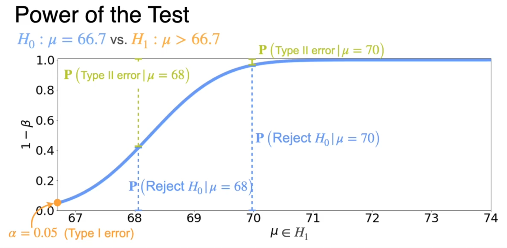

# ProbabilityandStatistics

- Probabilty: Event/(Sample space) - it is very important to think about complete output to get the sample space like throwing dice has sample space of 6 ,tossing coin one time is 2 ans so on. (Event: the possible output user in interested in.)  
- Complement of Probability : P(event)= 1- P(not event)  
- Sum of probability : Disjoint event : simply add them , joint : subtract the common one time .   
- Independent: Occuring of one event doesn't affect the second like what comes in first time in tossing coin does not affect the second so happening these consecutive event we can write in product rule which simplify our calcualation and we don't need to construct the whole sample space . Product rule of independent event : **P(A and B)= P(A)*P(B)**  
- Conditional Probability: Probability of happening one event if second event has already occured.  

                                     **P(A/B)= P(A and B)/P(B)**      
                                     
- Bayes’ Theorem

    **Definition:**  
    Bayes’ theorem is a way to **update our belief** (probability) about something when we get **new evidence**.  
    It connects what we already believe (the **prior**) with how likely the evidence is if our belief were true (the **likelihood**) to give us a new belief (the **posterior**).

    ### 🔢 Formula

    $$P(H | E) = \frac{P(E | H) \times P(H)}{P(E)}$$

    Where:
    - **P(H)** → Prior (initial belief about hypothesis H)  
    - **P(E|H)** → Likelihood (chance of seeing evidence E if H is true)  
    - **P(H|E)** → Posterior (updated belief after seeing E)  

    ---

    ### 🧬 Famous Disease Example

    Suppose:
    - 1% of people have a disease  
    - The test is 99% accurate (true positive and true negative)

    You test positive — what’s the chance you actually have the disease?

$$[
    \begin{align*}
    P(Disease) &= 0.01 \\
    P(Positive|Disease) &= 0.99 \\
    P(Positive|No\,Disease) &= 0.01 
    \end{align*}
]$$

$$[\
    P(Disease|Positive) = \frac{0.99 \times 0.01}{(0.99 \times 0.01) + (0.01 \times 0.99)} \approx 0.50
\]$$

So even with a positive test, there’s only about a **50% chance** you actually have the disease — because the disease is rare.

    ---

## Key Idea
    Bayes’ theorem helps you **update your belief** from a **prior** to a **posterior** when **new evidence** appears.  
    These is used in classification in ML like if what is the probability of a mail to be spam if lottery is in it.
# Naive Bays model
-   When predicting a class (like “spam” or “not spam”), Naïve Bayes assumes that each feature (like the words in an email) contributes to the outcome **independently**, even though in reality, features often influence each other.  
    $$\[
    P(C \mid x_1, x_2, \ldots, x_n) = \frac{P(C) \prod_{i=1}^{n} P(x_i \mid C)}{P(x_1, x_2, \ldots, x_n)}
    \]$$
# 📘 Lecture Summary: Mean & Expected Value

## 1. Concept of the Mean
- The **mean** represents the **center or balance point** of a distribution.  
- It is the value where the data (or probabilities) would balance on a scale.  
- Can be viewed as a **weighted average** of values.  

---

## 2. Sample Mean vs. Expected Value

### 🧩 **Sample Mean** ($\bar{x}$)
- Based on **observed data**.  
- Formula:  
  $$\bar{x} = \frac{1}{n} \sum_{i=1}^{n} x_i$$  
- Example: Kids’ ages → $\bar{x} = 1.3$ years.  
- Describes the **empirical** or **observed** average from data.

### 🎯 **Expected Value** ($E[X]$)
- Based on a **probability model** or theoretical distribution.  
- Formula (discrete):  
  $$E[X] = \sum_x x \, P(x)$$  
- Formula (continuous):  
  $$E[X] = \int_{-\infty}^{\infty} x \, f(x) \, dx$$  
- Example: Fair coin game → $E[X] = 0.5(10) + 0.5(0) = 5$.  
- Describes the **theoretical mean** or **long-run average**.

**Link:** The *sample mean* is an **estimate** of the *expected value*.  
They share the same formula structure, but:
- $\bar{x}$ uses **observed frequencies**,  
- $E[X]$ uses **true probabilities**.

---

## 3. Key Ideas
- **Mean = balancing point = weighted average.**  
- **Uniform distribution** $[a, b]$:  
  $$E[X] = \frac{a + b}{2}$$  
- **Mean ≠ Median:** the mean shifts toward the tail in skewed data.  
- **Discrete →** summation form; **Continuous →** integral form.  

---

## 📝 Summary
- **Sample Mean ($\bar{x}$):** empirical average from data.  
- **Expected Value ($E[X]$):** theoretical average from probability.  
- Both describe the **center of a distribution** — one from **data**, one from **theory**.

## 📊 Measures of Central Tendency

- **Mean ($\mu$):** Arithmetic average. Sensitive to outliers.  
  $$\mu = \frac{1}{n}\sum_{i=1}^{n} x_i$$

- **Median:** Middle value when data are ordered. Robust to outliers.  

- **Mode:** Most frequent value (highest probability density).  

---

### ⚖️ Skewness and Relationships

$$
\begin{cases}
\text{Symmetric: } \text{Mean} = \text{Median} = \text{Mode} \\
\text{Right-skewed: } \text{Mean} > \text{Median} > \text{Mode} \\
\text{Left-skewed: } \text{Mean} < \text{Median} < \text{Mode}
\end{cases}
$$

---

### 🎯 Examples

**Binomial Distribution ($n=5, p=0.5$):**  
$$\text{Mean} = np = 2.5, \quad \text{Median} = 2.5, \quad \text{Mode} = 2,3$$  

**Normal Distribution:**  
$$\text{Mean} = \text{Median} = \text{Mode}$$

## 🎲 Expected Value of a Function

### 🔹 Definition
For a discrete random variable $X$ with outcomes $x_i$ and probabilities $p(x_i)$:

$$
E[X] = \sum_i x_i \, p(x_i)
$$

For any function $g(X)$:

$$
E[g(X)] = \sum_i g(x_i) \, p(x_i)
$$

---

### 🎯 Example: Dice Game
- Roll a fair die with $p(x_i) = \frac{1}{6}$  
- Payoff = square of the number rolled  

$$
E[X^2] = \sum_{i=1}^{6} i^2 \cdot \frac{1}{6} = \frac{91}{6}
$$

---

### 💰 Linear Transformation of Expectation
If $Y = aX + b$, then:

$$
E[Y] = aE[X] + b
$$

**Implications:**
- $E[aX] = aE[X]$
- $E[b] = b$
- Expectation is a **linear operator**

---

### 🧠 Key Takeaway
Expectation preserves linearity:

$$
E[aX + b] = aE[X] + b
$$

and extends naturally to functions $g(X)$ by replacing $X$ with $g(X)$ in the summation.

## 🎯 Linearity of Expectation

### 🔹 Example 1: Coin + Dice Game
You play two games:
1. **Flip a coin** – win \$1 if heads, \$0 if tails.  
   → Expected value: $E[X_{\text{coin}}] = 0.5$
2. **Roll a die** – win the number rolled.  
   → Expected value: $E[X_{\text{dice}}] = 3.5$

Total winnings:  
$$
E[X_{\text{total}}] = E[X_{\text{coin}}] + E[X_{\text{dice}}] = 0.5 + 3.5 = 4
$$

Hence,  
> **$E[X + Y] = E[X] + E[Y]$**

---

### 🔹 Example 2: Name-Matching Game (Derangement Problem)
- There are $n$ people and $n$ unique names in a bag.  
- Each person randomly receives one name.  
- A *match* occurs when someone gets their own name.

#### 🎲 Case for 3 people (Aisha, Beto, Cameron)
All 6 possible name assignments are equally likely.  
Counting correct matches across all permutations gives:
$$
\text{Average matches} = \frac{3 + 1 + 1 + 1 + 0 + 0}{6} = 1
$$
So, on average, **1 person gets their own name**.

---

### 🔹 General Case for n People
Let:
- $M$ = total number of matches  
- $A_i$ = indicator variable (1 if person *i* gets their name, else 0)

Then:
$$
M = A_1 + A_2 + \dots + A_n
$$

Each person has a $1/n$ chance of receiving their own name:
$$
E[A_i] = \frac{1}{n}
$$

By linearity of expectation:
$$
E[M] = E[A_1] + E[A_2] + \dots + E[A_n] = n \cdot \frac{1}{n} = 1
$$

---

### 🧠 Key Takeaways
- **Linearity of expectation:**  
  $$E[X + Y] = E[X] + E[Y]$$  
  Holds **always** — no matter if variables are **independent or not**.
- Powerful tool for simplifying problems like expected matches or combined outcomes.

## 📈 Variance — Measuring the Spread

### 🔹 Why Variance?
The **expected value** tells us the *center* of a distribution,  
but **not how spread out** the data is.

Two games may have the same mean but very different risks:

- **Game 1:** Win \$1 for heads, lose \$1 for tails  
- **Game 2:** Win \$100 for heads, lose \$100 for tails  

Both have $E[X] = 0$, yet Game 2 is clearly *riskier*.  
This difference in “spread” is captured by **variance**.

---

### 🔹 Building Intuition
Variance measures how far outcomes typically are from the mean.

1. **Deviation:** $x - E[X]$  
   - Average deviation → always 0 (positives and negatives cancel out)  
2. **Absolute deviation:** $|x - E[X]|$  
   - Works conceptually, but difficult to handle mathematically  
3. **Squared deviation:** $(x - E[X])^2$  
   - Always positive and mathematically smooth ✅  

Hence, **variance** is simply the **average squared deviation**:

$$
\text{Var}(X) = E[(X - E[X])^2]
$$

---

### 🔹 Step-by-Step Meaning
1. Find the mean $E[X]$.  
2. Subtract it from each value (deviation).  
3. Square the deviations.  
4. Take the average (weighted by probabilities).  

That’s your variance — a measure of *spread* around the mean.

---

### 🎯 Example
- **Game 1:** Win/Lose \$2 → Variance = 4  
- **Game 2:** Win \$3 or Lose \$1 → Variance = 4  

Even though Game 2 has a higher mean, both have **the same variance**  
because their outcomes are equally spread around their own centers.

---

### 🔹 Alternative Formula
Variance can also be computed using:

$$
\text{Var}(X) = E[X^2] - (E[X])^2
$$

This comes from expanding $(X - E[X])^2$ and using linearity of expectation.

---

### 🔹 Effect of Linear Transformations
If $Y = aX + b$, then:

$$
\text{Var}(Y) = a^2 \, \text{Var}(X)
$$

**Interpretation:**
- Adding $b$ shifts the distribution (changes the center) but not the spread.  
- Multiplying by $a$ *scales* all deviations, so variance grows by $a^2$.

---

### 🧠 Intuitive Recap
- **Mean:** Center  
- **Variance:** Spread  
- **Add a constant ($b$):** Shifts, no change in spread  
- **Multiply by constant ($a$):** Stretch/squeeze → variance × $a^2$

Variance quantifies *how much outcomes fluctuate* —  
the mathematical backbone of “risk” and “uncertainty.”

## 📏 Standard Deviation — Practical Measure of Spread

### 🔹 Why Use It
- **Variance** shows spread but in **squared units** (e.g., m², ft²) — not intuitive.  
- **Standard deviation (σ)** = √Variance gives spread in the **same units** as the data.  

$$
\sigma = \sqrt{\text{Var}(X)}
$$

---

### 🔹 Use Case
- Provides an interpretable measure of variability.  
- In a **normal distribution**, it defines how data is spread around the mean:

| Range | Coverage |
|--------|-----------|
| μ ± 1σ | 68% of data |
| μ ± 2σ | 95% of data |
| μ ± 3σ | 99.7% of data |

---

**In short:**  
Standard deviation is the **real-world measure of uncertainty or consistency** in data — same units, clear meaning, widely used.

# 📈 Adding Gaussian Distributions: A Practical Guide

## 🎯 Core Concept
When you add two independent, normally distributed variables, their sum also follows a Gaussian distribution. This is powerful for modeling real-world systems like computer response times.

## 🔍 Understanding the Building Blocks

### What is a Gaussian Distribution?
Imagine a perfect bell curve - that's a Gaussian distribution. It describes how values cluster around an average.

  ^ Probability
  |
  |           •
  |         • • •
  |       •   •   •
  |     •     •     •
  |   •       •       •
  +---σ---μ---σ---→ Values

**Real-world examples:**
- Processing Time: Typically ~10ms, usually between 6-14ms
- Network Latency: Typically ~5ms, usually between 3-7ms

### What Does "Independent" Mean?
Two variables are independent when one doesn't affect the other. Think of it like:

✅ **Independent Examples:**
- Time to boil water 🍵 + Time to toast bread 🍞
- Your commute time 🚗 + Your friend's commute time 🚴

❌ **Dependent Examples:**
- Time to boil water 🍵 + Time to cook pasta 🍝
- Your commute time 🚗 + Traffic congestion 🚦

## 🧮 The Magic Formula

### Our Scenario:
- **Processing Time (T):** ~10ms ± 2ms
- **Network Latency (L):** ~5ms ± 1ms  
- **Total Response Time (R):** R = T + L

### The Result:

### How We Calculate It:

**Mean (Center Point):**

**Spread (Uncertainty):**

## 📊 Visualizing the Result

  ^
  |           •           | = Processing (10±2ms)
  |         • • •         | = Latency (5±1ms)
  |       •   •   •       | = Total (15±2.24ms)
  |     •     •     •
  |   •       •       •
  +---------|-------|-----→ Time (ms)
           10      15
          (Fast)  (Average)

## 💡 Key Takeaways

1. **The center moves:** 10ms + 5ms = 15ms average response time
2. **The spread grows:** But not simply 2ms + 1ms = 3ms! Instead, we get ~2.24ms
3. **The shape stays Gaussian:** The sum keeps the nice bell curve shape

## 🎯 Practical Interpretation
- **Most common scenario:** ~15ms total response time
- **Typical range:** 15ms ± 2.24ms (about 12.76ms to 17.24ms)
- **Rare cases:** <10.5ms or >19.5ms (very unusual)

This explains why your computer's total response time feels predictable, even though individual components have variability!

# 📊 Standardizing Distributions: Making Data Comparable

## 🎯 The Big Idea
We often want to compare different distributions on a common scale. Standardization transforms any distribution to have **mean = 0** and **standard deviation = 1**, making comparisons meaningful.

## 🔧 The Two-Step Process

### Step 1: Center the Distribution (Subtract the Mean)
**Goal:** Move the distribution to be centered at zero.

**Why it works:**
- Original variable: `X` with mean `μ`
- New variable: `X - μ`
- Mean becomes: `E[X - μ] = E[X] - μ = μ - μ = 0`

### Step 2: Scale the Distribution (Divide by Standard Deviation)
**Goal:** Make the spread exactly 1 unit.

**Why it works:**
- Variance of `cX` is `c² × Variance(X)`
- So Variance of `X/σ` = `(1/σ²) × Variance(X)` = `(1/σ²) × σ² = 1`
- Standard deviation = `√1 = 1`

## 🏆 The Complete Standardization Formula

**Standardized Variable = Z = (X - μ) / σ**

**Result:** A distribution with:
- ✅ **Mean = 0**
- ✅ **Standard Deviation = 1**

## 💡 Why This Matters

### Real-World Analogies:
- **Temperature Scales:** Converting °F to °C is like standardizing
- **Currency Conversion:** $100 USD ≈ €92 EUR (different scales, same value)
- **Test Scores:** Converting raw scores to percentiles

### Benefits:
1. **Comparability:** Compare heights, test scores, or incomes from different populations
2. **Detection of Outliers:** Values beyond ±2 or ±3 standard deviations are unusual
3. **Machine Learning:** Many algorithms work better with standardized data
4. **Statistical Tests:** Many assume standardized distributions

## 🎯 Quick Summary

| Step | Operation | Effect |
|------|-----------|---------|
| 1 | `X - μ` | **Centers** data (mean → 0) |
| 2 | `÷ σ` | **Scales** data (std dev → 1) |

**Final Result:** `Z = (X - μ)/σ` gives you a standardized variable perfect for analysis and comparison!

> 💡 **Remember:** This works for ANY distribution, not just Gaussian ones!

# 📐 Understanding Moments of a Distribution

## 🎯 The Big Idea
While mean and variance give us a basic picture of a distribution, **moments** provide a more complete mathematical description of its shape, including subtleties like skewness and kurtosis.

## 🔢 What Are Moments?

Moments are **expectations of powers** of a random variable. Think of them as building blocks that describe different aspects of a distribution's shape.

### Example Distribution:
| Value (x) | Probability |
|-----------|-------------|
| -2        | 1/3         |
| 0         | 1/6         |
| 1         | 1/2         |

## 🧮 The Moments Hierarchy

### First Moment: **Mean** (Center)

**Tells us:** Where the distribution is centered

### Second Moment: **Related to Variance** (Spread)
**Note:** This is NOT variance yet! Variance = E[X²] - (E[X])²

### Third Moment: **Skewness** (Asymmetry)

**Tells us:** Is the distribution symmetric or lopsided?

### Fourth Moment: **Kurtosis** (Tail heaviness)
**Tells us:** How fat are the tails? More extreme values?

## 📊 General Formula

For a random variable taking values x₁, x₂, ..., xₙ with probabilities p₁, p₂, ..., pₙ:

Where:
- **k = 1**: First moment (Mean)
- **k = 2**: Second moment (Related to Variance)
- **k = 3**: Third moment (Related to Skewness)
- **k = 4**: Fourth moment (Related to Kurtosis)

## 🎯 Why Moments Matter

| Moment | What It Reveals | Real-World Analogy |
|--------|-----------------|-------------------|
| **1st** | Center point | Average height in a room |
| **2nd** | Spread | How much heights vary |
| **3rd** | Symmetry | Are most people clustered to one side? |
| **4th** | Tail behavior | How many extremely tall/short people? |

## 💡 Key Insight

**Moments build upon each other:**
- Mean tells you **where** the data is
- Variance tells you **how spread out** it is  
- Skewness tells you **which way** it leans
- Kurtosis tells you about **extreme values**

> 🔍 **Coming next:** We'll see how these moments help us understand skewness (lopsidedness) and kurtosis (tail behavior) - the subtle features beyond mean and variance!

# 📊 Beyond Mean & Variance: Understanding Skewness Through Moments

## 🎯 The Problem: Same Mean & Variance, Different Stories

### Two Scenarios with Identical Statistics

#### Scenario 1: Playing the Lottery 🎫
- **Cost:** $1 per ticket
- **Jackpot:** $100 ($99 net win)
- **Probabilities:**
  - 1% chance: Win $99
  - 99% chance: Lose $1

#### Scenario 2: Car Insurance Company 🚗
- **Premium:** $1 per policy
- **Payout:** $100 if client crashes
- **Probabilities:**
  - 1% chance: Lose $99 (pay $100 - $1 premium)
  - 99% chance: Win $1

For both the seenarios mean and varience is equal , how to tell them apart. Let's go for the third momentum (skewness)  
E[X₁³] = (-1)³×0.99 + (99)³×0.01 = -0.99 + 9702.99 = 9,702  
E[X₂³] = (-99)³×0.01 + (1)³×0.99 = -9702.99 + 0.99 = -9,702  

## Formal defination of skewness  
Skewness = E[(X - μ)/σ]³

### Interpreting Skewness Values

| Skewness Value | Distribution Type | Description |
|----------------|-------------------|-------------|
| **> 0** | **Positively Skewed** | Tail extends to the right Mean > Median Example: Lottery |
| **= 0** | **Symmetric** | Balanced distribution Mean = Median Example: Normal distribution |
| **< 0** | **Negatively Skewed** | Tail extends to the left Mean < Median Example: Insurance |

## 🎯 Key Insights

### Why Third Moment Matters
- **Detects asymmetry** that mean and variance miss
- **Sensitive to extreme values** due to cubing
- **Reveals distribution direction** through sign

### Real-World Interpretation
- **Positive Skew (Lottery):** Small chance of big win, frequent small losses
- **Negative Skew (Insurance):** Small chance of big loss, frequent small gains

## 🚀 Practical Applications

### When to Use Skewness
1. **Risk Assessment:** Understand tail risks beyond volatility
2. **Investment Analysis:** Differentiate between lottery-like vs. insurance-like returns
3. **Quality Control:** Detect asymmetric process variations
4. **Financial Modeling:** Capture non-normal return distributions

### The Moments Hierarchy

    1st Moment (Mean) → Where is the center?  
    2nd Moment (Variance) → How spread out is it?  
    3rd Moment (Skewness) → Is it lopsided? Which way?   (from the mean value ofcouse)  

# 📊 Discovering Kurtosis: The Fourth Moment That Reveals Tail Risk

## 🎯 The Problem: Identical Mean, Variance, and Skewness

### Two Games with Surprisingly Similar Statistics

#### Game 1: Simple Coin Toss 🎲
- **50% chance:** Win $1
- **50% chance:** Lose $1

#### Game 2: Mostly Safe with Extreme Tails ⚡
- **100/202 ≈ 49.5% chance:** Win $0.10
- **100/202 ≈ 49.5% chance:** Lose $0.10
- **1/202 ≈ 0.5% chance:** Win $10
- **1/202 ≈ 0.5% chance:** Lose $10

Mean ,varience and skewness all are same for this game ,let's head out for the fourth momentum 

## 💡 The Breakthrough: Fourth Moment Reveals the Difference

### Fourth Moment Calculation

**Game 1 (Thin Tails):**  
E[X₁⁴] = (-1)⁴×0.5 + (1)⁴×0.5 = 0.5 + 0.5 = 1  

**Game 2 (Fat Tails):**  
E[X₂⁴] = 99.01   

## 📊 Formal Kurtosis Definition

### Standardized Kurtosis Formula
Kurtosis = E[(X - μ)/σ]⁴  

### Interpreting Kurtosis Values

| Kurtosis Value | Distribution Type | Description |
|----------------|-------------------|-------------|
| **< 3** | **Platykurtic** | Thin tails Less extreme values Example: Game 1 |
| **= 3** | **Mesokurtic** | Normal tails Standard normal distribution |
| **> 3** | **Leptokurtic** | Fat tails More extreme values Example: Game 2 |

## 🎯 Key Insights About Kurtosis

### What Kurtosis Measures
- **Tail heaviness** beyond what variance captures
- **Probability of extreme values** regardless of direction
- **Peakedness** of the distribution center

### Why Fourth Moment Works
- **Squares of squares** amplify extreme values
- **Ignores sign** (unlike skewness)
- **Highly sensitive** to outliers due to ^4 power

## 🚀 Practical Applications

### Real-World Examples
- **Finance:** Identifying "black swan" risk in investments
- **Quality Control:** Detecting rare but catastrophic failures
- **Risk Management:** Assessing extreme event probabilities
- **Insurance:** Pricing policies for rare, high-cost events

### The Complete Moments Framework  

## 💡 Risk Management Insight

**Game 1 vs Game 2:**
- Same **average** returns (mean = 0)
- Same **overall volatility** (variance = 1)
- Same **directional bias** (skewness = 0)
- **Different tail risk** (kurtosis reveals Game 2 has rare but catastrophic losses)

> 🎯 **The Bottom Line:** When mean, variance, and skewness all agree but the risks feel different, kurtosis reveals the hidden danger of extreme events in your distribution!  

# 📊 Essential Distribution Measures: Quantiles, Quartiles, and Beyond

## 🎯 Core Definitions

### Quantile
**Definition:** A quantile divides a sorted dataset into equal-sized subgroups. The k-th quantile is the value below which k% of the data falls.

**Mathematical Definition:**  
For a probability p (0 ≤ p ≤ 1), the p-th quantile Q(p) satisfies:
P(X ≤ Q(p)) = p  

**Example:**
- 0.25 quantile = 25% of data below this value
- 0.50 quantile = 50% of data below this value
- 0.75 quantile = 75% of data below this value

### Quartile
**Definition:** Quartiles are specific quantiles that divide data into four equal parts.  
**IQR** : Q3-Q1  

### Range
**Definition:** The difference between the maximum and minimum values in a dataset.  

Mean: Sensitive to outliers ❌
Median: Resistant to outliers ✅

Standard Deviation: Affected by extremes ❌
IQR: Focuses on central data   

**Key Insight**:  
Mean/Variance: "What's the average and spread?"
Quantiles: "Where do the data points actually fall?"  
Box and voilen polts are used for visualization.  

# 📊 Kernel Density Estimation: From Histograms to Smooth PDFs

## 🎯 The Problem with Histograms

### Limitations of Traditional Histograms
- **Discontinuous bars** create artificial "peaks and valleys"
- **Bin size dependency** - different bin widths give different pictures
- **Poor approximation** of smooth underlying distributions
- **Sensitive to bin placement** - small shifts change appearance dramatically

### Visual Comparison
# 🏔️ Kernel Density Estimation (KDE) - Visual Intuition

## 🎯 The Basic Idea
**Instead of grouping data into artificial bins (histograms), place a "probability mountain" at each data point and sum them up.**

## 🔄 Step-by-Step Process

### 1. Start with Raw Data Points

### 2. Add "Probability Mountains" at Each Point  
  ^     ^     ^     ^     ^
 / \   / \   / \   / \   / \
/   \ /   \ /   \ /   \ /   \   

### 3. Sum All the Mountains  
       *************
     ***           ***
   ***               ***
 ***                   ***

## ⚙️ The Key Control: Bandwidth  

### Small Bandwidth
- Thin, spiky mountains
- Follows data closely
- Risk: Too noisy, overfits

### Large Bandwidth  
- Wide, flat mountains
- Very smooth
- Risk: Oversmooths, misses patterns

### Good Bandwidth
- Natural smooth curve
- Balances detail and generalization

## 📊 KDE vs Histogram

| Aspect | Histogram | KDE |
|--------|-----------|-----|
| **Appearance** | Blocky, jagged | Smooth, natural |
| **Bin Dependence** | Highly dependent | Minimal dependence |
| **Continuous** | No (discrete bins) | Yes |
| **Small Samples** | Okay | Can be problematic |

## 🎯 When to Use KDE

- **Exploring continuous distributions**
- **Visualizing probability densities**
- **Comparing multiple distributions**
- **When you want smooth, professional plots**

## 💡 Key Insight
**KDE answers: "Given my measured data points, what's the probability of seeing ANY value - not just the ones I measured?"**

> 🎯 **Remember:** Each data point gets its own "little Gaussian mountain," and we sum all mountains to get the final smooth distribution!  

# 📊 Checking for Normal Distribution: QQ Plots Explained

## 🎯 Why Check for Normality?

### Many Statistical Methods Assume Normal Data
- **Linear Regression**
- **Logistic Regression** 
- **Gaussian Naïve Bayes**
- **Various Statistical Tests**

### The Problem: Is My Data Really Normal?

## 🔍 QQ Plots: The Visual Normality Test

### What is a QQ Plot?
A **Quantile-Quantile Plot** compares the quantiles of your data against the quantiles of a theoretical normal distribution.

### Step-by-Step Process

#### 1. Standardize Your Data

#### 2. Calculate Quantiles for Both
- **X-axis:** Theoretical normal distribution quantiles consider N(0,1) , consider mean 0 and SD=1.  
- **Y-axis:** Your actual data quantiles (may plot nomialized data or actual data as well)

#### 3. Plot and Compare

## 📈 Interpreting QQ Plots

### Perfect Normal Data

    ▲
    |       ••••••••••••••
    |     ••             ••
    |   ••                 ••
    | ••                     ••
    +-------------------------►
All points lie close to the reference line  

### Skewed Data (Newspaper Budget Example)
    ▲
    |       •••••••
    |     ••       •
    |   ••         •
    | ••           •
    |              ••••
    +-------------------------►
More points concentrated on one side
Curve away from reference line  

### Heavy-Tailed Data

    ▲
    |           •••••
    |         ••     ••
    |       ••         ••
    |     ••             ••
    |   ••                 ••
    | ••                     ••
    +-------------------------►
    Ends curve upward/downward from line  

## 🛠️ Practical Examples from the Text

### Case 1: Newspaper Budget Data - NOT Normal
**Histogram:** Clearly non-bell-shaped  
**QQ Plot:** Points significantly deviate from the reference line, especially in marked areas

### Case 2: Sales Data - Likely Normal  
**Histogram:** Bell-shaped curve  
**QQ Plot:** Points align well with the reference line

## 💡 Key Patterns to Recognize

| QQ Plot Pattern | What It Means | Data Characteristic |
|-----------------|---------------|---------------------|
| **Straight line** | Perfect normal | Ideal Gaussian |
| **S-shaped curve** | Heavy tails | More extremes than normal |
| **Curved up/down** | Skewness | Asymmetric distribution |
| **Most points on one side** | Skewed | Lopsided distribution |

## 🚀 How to Create a QQ Plot

### Manual Steps:
1. **Sort** your data
2. **Standardize** (subtract mean, divide by std dev)
3. **Calculate** theoretical normal quantiles
4. **Plot** data quantiles vs theoretical quantiles
5. **Add** reference line (y = x)

### In Practice:
Most statistical software (Python, R, Excel) can generate QQ plots automatically!

## 🎯 When to Use QQ Plots

### Strong Candidates:
- **Before** applying Gaussian-based models
- **Checking** assumptions of statistical tests
- **Comparing** distributions visually
- **Identifying** skewness and tail behavior

### Limitations:
- **Subjective** interpretation required
- **Sample size** affects reliability
- **Not a formal test** (use with statistical tests)

## 💡 Pro Tips

1. **Large samples** give clearer QQ plots
2. **Look for patterns**, not perfect alignment
3. **Combine** with histograms for better insight
4. **Consider formal tests** like Shapiro-Wilk for confirmation

> 📊 **Bottom Line:** QQ plots give you a powerful visual check for normality. If your points roughly follow the straight reference line, your data is likely normal enough for most statistical methods!

# 📊 Joint Distributions: Complete Guide from Discrete to Continuous

## 🎯 Core Concept: What are Joint Distributions?

**Joint distributions** describe how two or more random variables behave together, revealing relationships that individual distributions can't show.

## 1. Discrete Joint Distributions

### Example 2: Dice Rolling Scenarios

#### Case A: Independent Dice
- **X = first die**, **Y = second die**
- **Independent variables:** P(X,Y) = P(X) × P(Y)
- **All combinations equally likely:** 1/36 each

#### Case B: Dependent Variables  
- **X = first die**, **Y = sum of both dice**
- **Dependent relationship:** Knowing X affects possible Y values
- **Pattern emerges:** Different probabilities across combinations

## 2. Continuous Joint Distributions

### Real-World Example: Call Center Analytics
- **X = Waiting time** (0-10 minutes)
- **Y = Satisfaction rating** (0-10 scale)
- **Dataset:** 1,000 customers

### Key Insights from the Data:  
Distribution Pattern:
High Density Areas:
• Quick service + High satisfaction (bottom-right)
• Long waits + Low satisfaction (top-left) 

## 📈 Visualization Methods

### For Discrete Data:
- **Contingency tables**
- **Joint probability tables**
- **Scatter plots with counts**

### For Continuous Data:
- **Heat maps**
- **3D density plots** 
- **Scatter plots with density contours**

## 🎯 Key Formulas & Calculations

### Discrete Joint Probability:  
    P(X=x, Y=y) = Count(x,y) / Total

### Continuous Analysis:  
    Means: E[X], E[Y]
    Variances: E[X²] - E[X]², E[Y²] - E[Y]²  

## 💡 Real-World Applications

### Business Intelligence:
- **Customer service:** Wait time vs satisfaction
- **Product analysis:** Price vs demand
- **Quality control:** Process parameter A vs parameter B

## 🚀 Why Joint Distributions Matter

### Beyond Individual Variables:
- **Reveal relationships** between variables
- **Enable predictions** based on multiple factors
- **Identify patterns** invisible in single-variable analysis
- **Support decision-making** with comprehensive understanding

### Statistical Significance:
- **Independence testing:** Are variables related?
- **Correlation analysis:** How strongly are they related?
- **Multivariate modeling:** Building complex real-world models

> 📊 **The Big Picture:** Joint distributions transform our understanding from "what are the individual characteristics?" to "how do these characteristics interact and influence each other?" - providing the foundation for multivariate analysis and real-world problem solving!

# 📊 Marginal vs Conditional Probability: Complete Visual Guide

## 🎯 Core Concepts at a Glance

### Marginal Probability: "Ignoring Other Variables"
**What it is:** The probability of one variable regardless of other variables
**Intuition:** "I don't care about age, just show me all heights"

### Conditional Probability: "Given That" Probability  
**What it is:** The probability of one variable GIVEN we know another variable's value
**Intuition:** "Show me height distribution ONLY for 9-year-olds"

### Total Probability: "The Foundation"
**What it is:** The rule that connects marginal and conditional probabilities
**Intuition:** "Overall probability = sum of all conditional scenarios"

## 📊 Continuous Example: Call Center

### Marginal Distribution of Wait Time
- Aggregate over ALL satisfaction ratings
- Get overall wait time pattern
- "What are wait times like in general?"

### Conditional Distribution of Satisfaction
- Fix wait time = 4 minutes
- Look at satisfaction ratings ONLY for those calls
- "How satisfied are customers who waited exactly 4 minutes?"

## 🚀 Key Insights & Applications

### When to Use Each

| Use Case | Use This | Example |
|----------|----------|---------|
| **Overall trends** | Marginal | "What's the average height of all children?" |
| **Specific subgroups** | Conditional | "How tall are 9-year-olds?" |
| **Predictive models** | Both | "Given a child's age, predict their height" |

### Real-World Applications

**Healthcare:**
- Marginal: Overall disease prevalence
- Conditional: Disease risk given specific age/smoking status

**Business:**
- Marginal: Overall customer satisfaction
- Conditional: Satisfaction of customers who used specific feature

**Quality Control:**
- Marginal: Overall defect rate
- Conditional: Defect rate from Machine A only

## 💡 The Big Picture  

Joint Distribution (Full Table)
↓
Marginal (Row/Column Sums) Conditional (Slices)
↓ ↓
"Overall View" "Focused View"
\ /
\ /
\ /
↘ Total Probability ↙
(Connects Them All)

> 🎯 **Key Takeaway:** Marginal probability gives you the "forest" view (ignoring details), conditional probability gives you the "tree" view (focusing on specifics), and total probability shows how all the trees make up the forest!

## 🚀 Summary of Key Formulas

| Concept | Formula |
|---------|---------|
| **Conditional Probability** | `P(A\|B) = P(A∩B) / P(B)` |
| **Marginal from Joint** | `P(X) = Σ P(X,Y)` |
| **Total Probability** | `P(A) = Σ P(A\|Bᵢ)P(Bᵢ)` |
| **Bayes' Theorem** | `P(B\|A) = P(A\|B)P(B) / P(A)` |
| **Joint from Conditional** | `P(A∩B) = P(A\|B)P(B)` |

# 📊 Covariance: Measuring How Variables Move Together

## 🎯 The Core Idea

**Covariance** measures how two variables change together - whether they tend to increase/decrease together or move in opposite directions.

## 🧮 The Covariance Formula  
    cov(X,Y) = (1/n) × Σ[(x_i - μ_x) × (y_i - μ_y)]
    cov(X,Y) = E[(X - μ_x)(Y - μ_y)]

## 💡 Key Insights

### What Covariance Tells Us
| Covariance Value | Relationship | Interpretation |
|------------------|--------------|----------------|
| **Positive** | Variables move together | "When X increases, Y tends to increase" |
| **Zero** | No linear relationship | "X and Y move independently" |
| **Negative** | Variables move oppositely | "When X increases, Y tends to decrease" |

## 🚀 Practical Applications

### Real-World Examples
- **Finance:** Stock prices that move together
- **Healthcare:** Drug dosage vs symptom improvement  
- **Education:** Study time vs test scores
- **Business:** Advertising spend vs sales

### Limitations to Remember
- **Scale Dependent:** Larger numbers give larger covariance
- **No Standard Range:** Hard to interpret magnitude
- **Linear Only:** Only captures linear relationships

## 📊 Comparison Summary

| Metric | Measures | Scale | Interpretation |
|--------|----------|-------|----------------|
| **Variance** | Spread of one variable | Always ≥ 0 | "How much one variable varies" |
| **Covariance** | Relationship between two variables | Any real number | "How two variables vary together" |

> 🎯 **Key Takeaway:** Covariance answers the question "When X moves away from its average, does Y consistently move in a particular direction relative to its average?"   

# 🎲 Covariance in Action: Game Theory Examples

## 🎯 The Puzzle: Four Games with Same Means & Variances

### All Games Have Identical Individual Statistics:
- **E[X] = E[Y] = 0** (for Games 1-3), **E[X] = E[Y] = 1/6** (Game 4)
- **Var[X] = Var[Y] = 1** (for Games 1-3), **Var[X] = Var[Y] = 0.806** (Game 4)
- **Individual perspective:** All games look identical for each player

## 🎮 The Four Games Explained

### Game 1: "Team Players" 🤝
**Outcomes:**
- Both win $1 (probability 1/2)
- Both lose $1 (probability 1/2)

**Pattern:** Perfect positive correlation  
Scatter Plot:  
    ▲ Y ($)
    | • (1,1)
    |
    |• (-1,-1)
    +-----------► X ($)

### Game 2: "Zero-Sum Game" ⚖️
**Outcomes:**
- X wins $1, Y loses $1 (probability 1/2)  
- X loses $1, Y wins $1 (probability 1/2)

**Pattern:** Perfect negative correlation
Scatter Plot:  
    ▲ Y ($)
    |• (-1,1)
    |
    | • (1,-1)
    +-----------► X ($)

### Game 3: "Independent Moves" 🎲
**Outcomes:** All four combinations equally likely (probability 1/4 each)
- (1,1), (1,-1), (-1,1), (-1,-1)

**Pattern:** No correlation  
    ▲ Y ($)
    |• •
    |
    |• •
    +-----------► X ($)

### Game 4: "Weighted Team Game" ⚖️🤝
**Outcomes:**
- Both win $1 (probability 1/2)
- Both lose $1 (probability 1/3)  
- No change (probability 1/6)

**Pattern:** Positive correlation with unequal probabilities

## 📊 Covariance Calculations

### General Covariance Formula  
    cov(X,Y) = E[XY] - E[X]E[Y]

### Game 1: Positive Covariance (+1)

### Game 2: Negative Covariance (-1)

### Game 3: Zero Covariance (0)

### Game 4: Positive Covariance (0.806)

## 💡 Key Insights

### What Covariance Reveals
| Game | Covariance | Relationship | Interpretation |
|------|------------|--------------|----------------|
| **1** | +1 | Perfect positive | "We sink or swim together" |
| **2** | -1 | Perfect negative | "My gain is your loss" |
| **3** | 0 | No linear relationship | "Our results are independent" |
| **4** | +0.806 | Strong positive | "We usually win/lose together" |

### The Power of Covariance
- **Discriminates** between games that look identical individually
- **Captures relationships** that mean and variance miss
- **Reveals dependency patterns** between variables

for non uniform : this is same as earlier formula as weight is not equal we multiply with indivisual probability.  
    cov(X,Y) = Σ Σ P(X=x, Y=y) × (x - μ_x)(y - μ_y) 

# 📊 Covariance Matrix: The Big Picture

## 🎯 What is a Covariance Matrix?
A **square matrix** that organizes all variances and covariances between multiple variables.

## 📐 Structure
For variables X₁, X₂, ..., Xₙ:

Covariance Matrix Σ =   
    [ Var(X₁) Cov(X₁,X₂) ... Cov(X₁,Xₙ) ]  
    [ Cov(X₂,X₁) Var(X₂) ... Cov(X₂,Xₙ) ]  
    [ ... ... ... ... ]   
    [ Cov(Xₙ,X₁) Cov(Xₙ,X₂) ... Var(Xₙ) ]  

# 📈 Correlation Coefficient: Standardized Covariance

## 🎯 The Problem with Covariance
- **No standard scale:** Covariance values can be any size
- **Hard to compare:** Is 17 stronger than 7.45? Can't tell!
- **Unit-dependent:** Affected by measurement scales

## 💡 The Solution: Correlation Coefficient  
        ρ = cov(X,Y) / (σₓ × σᵧ)

## 🔢 Key Properties
- **Range:** Always between -1 and +1
- **Interpretation:**
  - **+1:** Perfect positive correlation
  - **-1:** Perfect negative correlation  
  - **0:** No linear correlation ("When X increases, does Y consistently increase/decrease by the same amount?" that what corelation  caputures )  
- **Scale-invariant:** Same interpretation regardless of units

## 📊 Examples from Text
- Age vs Naps: ρ = -0.894 (strong negative)
- Age vs Height: ρ = +0.893 (strong positive)  
- Age vs Grades: ρ = +0.01 (no correlation)
- Wait time vs Rating: ρ = -0.845 (strong negative)

## 🚀 Why It's Better
- **Comparable:** Can directly compare relationships
- **Intuitive:** Clear strength interpretation
- **Standardized:** Removes scale dependencies

> 💡 **Bottom Line:** Correlation coefficient gives a standardized measure of relationship strength that covariance alone cannot provide.

# 📊 Multivariate Gaussian: The Multi-Dimensional Bell Curve

## 🎯 Core Concept
Extends the normal distribution to multiple variables, creating a "bell" in higher dimensions.

## 📈 Key Features
- **Center:** Mean vector μ (replaces single mean)
- **Spread:** Covariance matrix Σ (replaces variance)
  - **Diagonal:** Variances of individual variables
  - **Off-diagonal:** Covariances between variables

## 🔄 Visual Difference
- **Independent variables:** Circular contours (like a symmetric hill)
- **Dependent variables:** Elliptical contours (stretched along correlation direction)

## 🧮 Formula Evolution  
    Univariate: f(x) = (1/√(2πσ²)) × exp(-(x-μ)²/(2σ²))

    Multivariate: f(x) = (1/√((2π)ⁿ|Σ|)) × exp(-½(x-μ)ᵀΣ⁻¹(x-μ))

## 🚀 Why It Matters
- Foundation for many machine learning algorithms
- Naturally handles correlated variables
- Extends intuitive bell curve to multiple dimensions

> 💡 **One-liner:** A multivariate Gaussian is a bell curve that can be stretched and tilted based on how variables relate to each other.

#  Week 03

# 📊 Population vs Sample: Statistics Foundation

## 🎯 Core Definitions
- **Population:** Entire group you want to study (N = total size)
- **Sample:** Subset you actually measure (n = sample size)

## 🔑 Key Principles
### Good Sampling:
- **Random selection** (no bias)
- **Independent** picks (one pick doesn't affect others). Independent sampling ensures each data point brings unique, uncorrelated information to your model—like getting multiple independent opinions rather than one person repeating themselves   
- **Identically distributed** (same selection rules) means identically distributed to population.  

### Bad Sampling:
- **Biased selection** (e.g., only short people)
- **Dependent samples** (picks affect each other)
- **Non-representative** (only specific subgroups)

## 🚀 Machine Learning Context
- **All datasets are samples** - never the full population
- **Representativeness matters** - biased data → biased models
- **Real-world example:** Cat images must include diverse backgrounds

## 💡 Why It Matters
Samples allow us to make inferences about populations when measuring everyone is impossible.

> 🎯 **Bottom Line:** Good sampling = random, independent, representative selection from   

# 📊 Sample Size vs Estimation Accuracy

## 🎯 Key Demonstration
**Larger sample sizes give better estimates of population parameters**

## 📈 Examples from Statistopia

### Population (N=10)
- **True mean (μ):** 160 cm
- **All 10 people measured**

### Sample 1 (n=6)
- **Sample mean (x̄₁):** 160.97 cm
- **Close to true mean** - good estimate

### Sample 2 (n=6) - Biased
- **Sample mean (x̄₂):** 156 cm  
- **Poor estimate** - accidentally picked shortest people

### Sample 3 (n=2)
- **Sample mean (x̄₃):** 158 cm
- **Less reliable** - small sample size

> 💡 **Bottom Line:** Bigger random samples give better estimates of population characteristics. Small samples are cheaper but risk being misleading.    
But how to check which size is good ?? Will discuss that later .  

# 📊 Sample Variance: The n-1 Mystery Solved

## 🎯 The Core Problem
When estimating **population variance** from a sample, using the obvious formula gives a **biased estimate** (consistently too small).

# 📊 Sample Variance: Why n-1?

## 🔍 Simple Reason
- Using sample mean (x̄) instead of true mean (μ) **loses one degree of freedom**
- n-1 corrects for this systematic underestimation

## 📈 When It Matters
- **Small samples:** Big difference (n=10 → 10% error)
- **Large samples:** Small difference (n=1000 → 0.1% error)

## 🎯 Bottom Line
**Always use n-1 for sample variance** to get accurate population estimates.  

# 📊 Law of Large Numbers

## 🎯 Core Principle
**Larger samples → Better estimates** of population parameters

## 🔍 Simple Explanation
- **Small sample:** Noisy, unreliable estimate
- **Large sample:** Stable, accurate estimate
- **As n → ∞:** Sample mean → Population mean

## 📈 Key Requirements
- **Random sampling**
- **Independent observations** 
- **Identically distributed** data

## 💡 Bottom Line
**More data = Better truth** - sample averages converge to population means with larger samples.  

# 📊 Central Limit Theorem (CLT)

## 🎯 The Magic
**Any distribution → Normal distribution** when you take averages of large samples

## 🔍 Core Insight
- Start with **any distribution** (even weird/skewed ones)
- Take **multiple samples**, calculate their averages  
- Plot **all these averages** → You get a normal distribution!

## 📈 Coin Flip Example
- **1 coin:** Weird distribution (0 or 1)
- **10 coins:** Starts looking normal
- **More coins:** Perfect bell curve emerges

## 💡 Why It Matters
- Explains why normal distribution is everywhere
- Allows using normal statistics on non-normal data
- Foundation for many statistical tests

## 🚀 Bottom Line
**Averages become normal** regardless of original data distribution - this is statistical magic!  

# 📊 Central Limit Theorem (CLT) - Complete Guide

## 🎯 Formal Definition
As n approaches infinity, the **standardized average** of n independent, identically distributed random variables follows a standard normal distribution.

### Mathematical Statement:  
  Let X₁, X₂, ..., Xₙ be independent, identically distributed (i.i.d.) random variables with:
    E[Xᵢ] = μ and Var[Xᵢ] = σ²

    Then as n → ∞:
    (X̄ₙ - μ) / (σ/√n) → N(0,1)

    Where:
    X̄ₙ = (X₁ + X₂ + ... + Xₙ)/n (sample mean)  

## 🔍 What is 'n' in CLT?
**n = Number of observations in a SINGLE sample** (NOT the number of samples)

### Clear Example:  
Study: Average height of adults
• You take ONE sample of 100 people → n = 100
• You calculate ONE average from these 100 heights
• CLT describes what happens to the average when n increases    

## 💡 Key Clarifications

### n → ∞ vs Whole Population
**n → ∞ does NOT mean taking the whole population**

- **Whole Population:** Measure everyone → Get exact mean μ
- **n → ∞ in CLT:** Take larger samples → Distribution of averages approaches normal
- **Practical:** n ≥ 30 is often "sufficiently large"

### What CLT Actually Describes
"If you take **many samples** (each with n observations) and calculate the average for each sample, the **distribution of those sample averages** will be normal."

## 🚀 Practical Implications  

### Why CLT is Revolutionary
- **Transforms any distribution** into normal shape through averaging
- **Works regardless** of original distribution shape
- **Foundation for statistical inference**

### Real-World Applications
1. **Quality Control:** Average product dimensions
2. **Election Polling:** Sample proportions become normal
3. **Medical Research:** Average treatment effects
4. **Machine Learning:** Sampling distributions of parameters

- Enables comparison across different sample sizes
- Provides universal reference (standard normal)

## 📈 Sample Size Guidelines

- **n = 30:** Safe threshold for most distributions
- **Well-behaved data:** CLT works with smaller n
- **Skewed distributions:** May require larger n
- **Uniform data:** CLT kicks in faster (n=3-5 works)

## 🎯 Conditions for CLT  

1. **Independent** samples
2. **Identically distributed** (same population)
3. **Finite variance** (σ² < ∞)

## 🔥 Bottom Line

**The Central Limit Theorem allows us to use normal distribution statistics on virtually any data by working with sample averages rather than individual observations. This is why averages become normal regardless of the original data distribution!**

## 💡 Key Insight  

CLT is about the behavior of SAMPLE AVERAGES as sample size increases, not about measuring the entire population.
The variance σ²/n measures how much sample averages vary around the true mean. As n grows, this variation shrinks to zero, meaning sample averages become perfect estimates of μ.

## 🚀 Bottom Line

If we knew the true mean μ, then with infinite data, every sample average would equal μ exactly (zero variance between sample means and true mean).
We use the shrinking variance σ²/n to quantify how close our sample averages are likely to be to the unknown true mean μ.  

# Maximum Likelihood Estimation (MLE) Summary

## Core Concept
- **Goal**: Find the scenario or model that makes the observed evidence most probable
- **Approach**: Compare conditional probabilities of evidence given different scenarios
- **Selection**: Choose the scenario with the **highest probability** of producing the evidence

## Simple Example: Popcorn on Floor
**Evidence**: Popcorn on floor  
**Possible Scenarios**:
- `P(popcorn | movies)` → **High**
- `P(popcorn | board games)` → **Medium**  
- `P(popcorn | nap)` → **Low**

**Conclusion**: Movies most likely caused the popcorn (highest conditional probability)

## Connection to Machine Learning
- **Data** = Evidence (like popcorn)
- **Models** = Scenarios (like movies/board games/nap)
- **Process**: Calculate `P(data | model)` for each model
- **Result**: Select model with **highest** `P(data | model)`

## Key Insight
We pick the model that **most likely generated the observed data** by maximizing:  
    P(evidence | scenario)

## Linear Regression Context
In regression, we choose the line that makes observed data points **most probable**, considering points are typically generated with some noise around the line.  

# Maximum Likelihood Estimation: Coin Example

## Problem Setup
- **Scenario**: Coin tossed 10 times → 8 heads, 2 tails
- **Candidate Coins**:
  - Coin 1: P(heads) = 0.7
  - Coin 2: P(heads) = 0.5 (fair)
  - Coin 3: P(heads) = 0.3

## Calculating Probabilities
**Probability of 8 heads, 2 tails for each coin**:
- **Coin 1**: `0.7⁸ × 0.3² = 0.0051`
- **Coin 2**: `0.5¹⁰ = 0.0010` 
- **Coin 3**: `0.3⁸ × 0.7² = 0.00003`

**Conclusion**: Coin 1 most likely generated the data (highest probability)

## Generalizing the Problem
**For any coin with P(heads) = p**:
- **Likelihood**: `L(p) = p⁸ × (1-p)²`
- **Goal**: Find `p` that maximizes this likelihood

## Mathematical Optimization
**Log-Likelihood Trick**:
- Convert product to sum: `log(L(p)) = 8·log(p) + 2·log(1-p)`
- Take derivative and set to zero:  
      d/dp [log(L(p))] = 8/p - 2/(1-p) = 0

- **Optimal solution**: `p̂ = 8/10 = 0.8`

## General Case Formula
For `n` coin tosses with `k` heads:
- **Optimal probability**: `p̂ = k/n` (sample mean)
- **MLE selects the coin that matches the observed frequency**

## Key Insight
Maximum Likelihood Estimation finds the parameter value that makes the observed data **most probable**, which in this case is simply the empirical proportion of heads.  

# Maximum Likelihood Estimation: Gaussian Distribution Example

## Problem Setup
- **Observations**: Numbers 1 and -1
- **Goal**: Determine which distribution most likely generated these points

## Comparing Different Means
**Candidate Distributions** (all with σ = 1):
- Normal(μ = -1, σ = 1)
- Normal(μ = 0, σ = 1) 
- Normal(μ = 1, σ = 1)

**Likelihood Calculation**:
- For μ = -1: L = 0.399 × 0.054 = 0.022
- For μ = 0: L = 0.242 × 0.242 = 0.059 ✓
- For μ = 1: L = 0.054 × 0.399 = 0.022

**Result**: Normal(μ = 0, σ = 1) wins (highest likelihood)

**Key Insight**: The optimal mean μ equals the sample mean (0)

## Comparing Different Variances
**Candidate Distributions** (all with μ = 0):
- Normal(μ = 0, σ = 0.5)
- Normal(μ = 0, σ = 1)
- Normal(μ = 0, σ = 2)

**Likelihood Calculation**:
- For σ = 0.5: L = 0.044 × 0.044 = 0. , these are probablities of 1 and -1 in all three cases.  
- For σ = 1: L = 0.242 × 0.242 = 0.059 ✓
- For σ = 2: L = 0.176 × 0.176 = 0.031

**Result**: Normal(μ = 0, σ = 1) wins again

**Key Insight**: The optimal variance σ² equals the sample variance (1), and distribution mean is equal to sample mean which is 0.

## General Pattern
For Gaussian distributions, MLE gives:
- **Optimal mean**: Sample mean
- **Optimal variance**: Sample variance

## Visual Interpretation
- **Likelihood** = Height of probability density curve at observed points
- **Total likelihood** = Product of individual likelihoods (for independent observations)
- MLE selects the distribution that maximizes this product

## Next Steps
- Mathematical derivation of MLE formulas
- Interactive tool to explore MLE with binomial and normal distributions
- Applications of these concepts in practice   

# Maximum Likelihood Estimation in Linear Regression

## Core Concept
- **Goal**: Find the model that most likely generated the observed data
- **Process**: Calculate `P(data | model)` for each candidate model
- **Selection**: Choose model with highest probability

## Linear Regression Example
**Scenario**: Fitting a line to data points
**Candidate Models**: Three different lines (Model 1, 2, 3)

## How Lines Generate Points
- Each line represents a "road"
- Points are "houses" built near the road
- Points are sampled from Gaussian distributions centered on the line
- For each x-value, a Gaussian is centered at the corresponding y-value on the line

## Mathematical Formulation
**For a line**: `y = mx + b`
**At each point xᵢ**:
- Gaussian centered at line's y-value
- Generated point: sampled from this Gaussian
- Distance from line: `dᵢ` (vertical distance)

**Likelihood for one point**:  
    Lᵢ = (1/√(2π)) × e^(-½dᵢ²)
**Total likelihood** (for all points):
    L = ∏ Lᵢ = constant × e^(-½∑dᵢ²)

## Optimization
**Log-likelihood**:  
    log(L) = constant - ½∑dᵢ²

**To maximize likelihood**:
- Maximize `log(L)`
- Equivalent to minimizing `∑dᵢ²` (sum of squared distances)

## Key Insight
**Maximum Likelihood Estimation for linear regression with Gaussian errors = Least Squares Regression**

- Both methods minimize the sum of squared distances
- The "best fit" line is the one that makes observed points most probable
- MLE provides probabilistic interpretation for linear regression

## Visual Confirmation
Among candidate lines, the one with:
- Highest likelihood product
- Smallest sum of squared distances
- Best visual fit to data points

**wins the selection**  

# Regularization in Machine Learning

## The Overfitting Problem
**Scenario**: Three models fitting the same dataset:
- **Model 1**: Linear (degree 1)
- **Model 2**: Quadratic (degree 2) 
- **Model 3**: High-degree polynomial (degree 10)

**Initial Loss (Squared Error)**:
- Model 1: 10
- Model 2: 2
- Model 3: 0.1 ✓ (apparent winner)

**Issue**: Model 3 fits training data perfectly but is "chaotic" and won't generalize well

## Regularization Solution
**Goal**: Penalize model complexity to prevent overfitting

### L₂ Regularization (Ridge)
**Penalty Calculation**:
- **Model 1**: `y = 4x + 3` → Penalty = `4² = 16`
- **Model 2**: `y = 2x² - 4x + 5` → Penalty = `2² + (-4)² = 20`
- **Model 3**: Complex polynomial → Penalty = `262`

**Regularized Loss** = Original Loss + Penalty:
- Model 1: `10 + 16 = 26`
- Model 2: `2 + 20 = 22` ✓ (new winner)
- Model 3: `0.1 + 262 = 262.1`

## General Formula
**Regularized Error**:
      Regularized Error = Log Loss + λ × L₂_regularization_error

Where:
- **λ** = regularization parameter (controls penalty strength)
- **L₂ regularization error** = sum of squares of coefficients (excluding constant term)

## Key Benefits
- Prevents overfitting by penalizing complex models
- Encourages simpler models that generalize better
- Balances model fit with model complexity
- The "simplest model that fits the data well" wins

## Connection to Probability
The text hints that regularization has a probabilistic interpretation related to maximum likelihood (to be explained next)  

# Beyond Maximum Likelihood: Incorporating Prior Probabilities

## The Popcorn Example Revisited
**Evidence**: Popcorn on floor
**New Candidate Scenarios**:
- Watching movies → High probability of popcorn
- Popcorn throwing contest → Very high probability of popcorn

## The Problem with Pure MLE
- **MLE approach**: Maximize `P(popcorn | scenario)`
- **Result**: Contest wins (higher conditional probability)
- **Intuition**: This feels wrong - movies should be more likely

## The Missing Piece: Prior Probabilities
**Key Insight**: We need to consider how likely each scenario is *independently*

**Prior Probabilities**:
- `P(movies)` = High (common activity)
- `P(contest)` = Very low (rare event)

## Bayesian Approach
**Maximize Joint Probability**:  
    P(popcorn AND scenario) = P(popcorn | scenario) × P(scenario)

**Calculation**:
- Movies: `P(popcorn|movies) × P(movies)` = High × High = High
- Contest: `P(popcorn|contest) × P(contest)` = Very High × Very Low = Medium/Low

**Result**: Movies now wins (higher joint probability)

## Mathematical Foundation
This is essentially **Bayes' Theorem**:  
    P(scenario | popcorn) ∝ P(popcorn | scenario) × P(scenario)

Where:
- `P(scenario | popcorn)` = What we really want (posterior)
- `P(popcorn | scenario)` = Likelihood (MLE term)
- `P(scenario)` = Prior probability

## Key Takeaway
Pure Maximum Likelihood Estimation can be misleading when scenarios have different base rates. The Bayesian approach combines:
- **Likelihood**: How well the scenario explains the evidence
- **Prior**: How plausible the scenario is overall

This prevents us from choosing implausible explanations that happen to fit the evidence well.  

# Frequentist vs Bayesian Statistics

## The Coin Toss Story
**Scenario**: Coin tossed 10 times → 8 heads, 2 tails

### Frequentist Approach
- **Interpretation**: Probability = long-term frequency
- **Conclusion**: `P(heads) = 8/10 = 0.8`
- **Method**: Uses only observed data (no prior beliefs)

### Bayesian Approach  
- **Prior Belief**: Coins are usually fair → `P(heads) ≈ 0.5`
- **Updated Belief**: Adjusts slightly based on evidence → `P(heads) ≈ 0.52`
- **Method**: Combines prior belief with observed data

## Core Philosophical Differences

### Probability Interpretation
| **Frequentist** | **Bayesian** |
|-----------------|--------------|
| Long-term frequency of events | Degree of belief/certainty |
| Objective, data-driven | Subjective, incorporates prior knowledge |

### Use of Priors
| **Frequentist** | **Bayesian** |
|-----------------|--------------|
| No concept of priors | Explicitly uses prior beliefs |
| Only uses observed evidence | Combines prior knowledge with new data |

### Goal
| **Frequentist** | **Bayesian** |
|-----------------|--------------|
| Find model with highest likelihood of generating data | Update prior beliefs based on new evidence |

## Key Concepts

### Frequentist Statistics
- Maximum Likelihood Estimation (MLE)
- Relies solely on observed data
- Probability = limiting frequency over infinite trials

### Bayesian Statistics  
- **Prior**: Initial belief before seeing data
- **Likelihood**: Probability of data given model
- **Posterior**: Updated belief after seeing data
- Uses Bayes' Theorem: `P(model|data) ∝ P(data|model) × P(model)`

## Practical Implications
- **Frequentist**: More objective, but ignores domain knowledge
- **Bayesian**: Incorporates expert knowledge, but requires specifying priors
- **MLE** (previously discussed) follows frequentist approach

## Next Steps
Exploring how priors affect predictions in Bayesian analysis  

# Bayesian Priors and MAP Estimation

## Three Bayesian Statisticians, One Coin

### Different Prior Beliefs
**Scenario**: Three Bayesians find a coin and want to estimate P(heads)

| Statistician | Prior Type | Belief Strength | Prior Shape |
|--------------|------------|-----------------|-------------|
| **1. Conservative** | Strong prior | Very strong | Narrow curve centered at 0.5 |
| **2. Moderate** | Mild prior | Moderate | Wider curve centered at 0.5 |
| **3. Agnostic** | Non-informative | No assumptions | Flat curve (all values equally likely) |

## Updating Beliefs with Evidence

### After 1 Coin Toss (Heads)
- **Conservative**: Belief barely changes
- **Moderate**: Slight shift toward heads
- **Agnostic**: Drastic change - now favors heads

### After 10 Tosses (8 Heads, 2 Tails)
- **Conservative**: Curve still centered near 0.5 (barely moved)
- **Moderate**: Curve peaks around 0.65 (significant shift)
- **Agnostic**: Curve peaks at 0.8 (fully data-driven)

## Maximum A Posteriori (MAP) Estimation

### Definition
- **MAP** = Value that maximizes the posterior belief
- **Posterior** = Updated belief after seeing data
- **Method**: Take the **mode** of the posterior distribution

### MAP Results for Each Bayesian
| Statistician | MAP Estimate | Interpretation |
|--------------|--------------|----------------|
| **Conservative** | 0.501 | Almost unchanged from prior |
| **Moderate** | 0.607 | Balanced update |
| **Agnostic** | 0.8 | Matches frequentist approach |

## Key Insights

### Prior Strength Matters
- **Strong prior**: Requires lots of evidence to change beliefs
- **Weak prior**: Quickly adapts to new data
- **Non-informative prior**: Becomes equivalent to frequentist MLE

### MAP vs MLE
- **MAP** = Mode of posterior = `argmax P(θ|data)`
- **MLE** = Mode of likelihood = `argmax P(data|θ)`
- **Relationship**: MAP = MLE when using uniform prior

### Philosophical Implications
- Priors encode domain knowledge and experience
- Different starting beliefs lead to different conclusions
- Non-informative priors bridge Bayesian and frequentist methods

## Visual Learning
The curves representing beliefs show:
- Most likely parameter value (peak)
- Strength of belief (curve width)
- How beliefs evolve with new evidence

## Next Steps
Mathematical derivation of how to update beliefs using Bayes' Theorem   

# Bayesian Statistics: Mathematical Foundation

## Bayes' Theorem Framework

### Core Equation  
    P(A|B) = [P(B|A) × P(A)] / P(B)

### Bayesian Interpretation
| Term | Meaning | Example (Job Offer) |
|------|---------|---------------------|
| **P(A\|B)** | Posterior | Probability of job offer given phone interview |
| **P(B\|A)** | Likelihood | Probability of interview given job offer |
| **P(A)** | Prior | Initial belief about job offer chances |
| **P(B)** | Evidence | Overall probability of getting interview |

## Coin Example: Fair vs Biased

### Setup
- **Y** (parameter): Type of coin
  - Y = 0.5 (fair coin)
  - Y = 0.8 (biased coin)
- **X** (evidence): Coin flip result
  - X = 0 (tails)
  - X = 1 (heads)

### Priors
- P(Y=0.5) = 0.75 (most coins are fair)
- P(Y=0.8) = 0.25 (few coins are biased)

### Evidence: Heads (X=1)

#### Calculate P(Y=0.5 | X=1)
    P(Y=0.5|X=1) = [P(X=1|Y=0.5) × P(Y=0.5)] / P(X=1)
    = [0.5 × 0.75] / P(X=1)

#### Calculate P(X=1) - Total Probability  
    P(X=1) = P(X=1|Y=0.5)P(Y=0.5) + P(X=1|Y=0.8)P(Y=0.8)
      = (0.5 × 0.75) + (0.8 × 0.25)
      = 0.375 + 0.2 = 0.575

#### Final Calculation  
      P(Y=0.5|X=1) = (0.5 × 0.75) / 0.575 = 0.652
      P(Y=0.8|X=1) = (0.8 × 0.25) / 0.575 = 0.348   

### Results
- **Prior**: 75% belief in fair coin
- **Posterior**: 65.2% belief in fair coin (decreased)
- **Updated**: 34.8% belief in biased coin (increased)

## Generalized Bayes' Theorem

### Discrete Random Variables
    P(Y=y|X=x) = [P(X=x|Y=y) × P(Y=y)] / P(X=x)

Where:
- **P(Y=y|X=x)** = Posterior PMF
- **P(X=x|Y=y)** = Likelihood PMF  
- **P(Y=y)** = Prior PMF
- **P(X=x)** = Evidence PMF

### Continuous Random Variables
Replace Probability Mass Functions (PMFs) with Probability Density Functions (PDFs):
      f(Y=y|X=x) = [f(X=x|Y=y) × f(Y=y)] / f(X=x)

### Mixed Cases
| X Type | Y Type | Functions Used |
|--------|--------|----------------|
| Discrete | Discrete | PMF for both |
| Continuous | Continuous | PDF for both |
| Discrete | Continuous | PMF for X, PDF for Y |
| Continuous | Discrete | PDF for X, PMF for Y |

## Machine Learning Notation
Often replace Y with θ (parameter):
    P(θ|X) ∝ P(X|θ) × P(θ)

Where:
- **P(θ|X)** = Posterior distribution
- **P(X|θ)** = Likelihood function
- **P(θ)** = Prior distribution

## Key Properties
- **Normalization**: Posteriors sum to 1
- **Bayesian Update**: Prior → Evidence → Posterior
- **Iterative**: Posterior becomes prior for next update
- **Flexible**: Works with discrete/continuous variables

# Connecting MLE, MAP, and Regularization

## The Model Selection Problem

### Pure Maximum Likelihood Approach
- **Goal**: Maximize `P(data | model)`
- **Result**: Complex models win (overfit)
- **Issue**: Ignores model simplicity

### Bayesian Approach (MAP)
- **Goal**: Maximize `P(model | data) ∝ P(data | model) × P(model)`
- **Considers both**:
  - How well model fits data (`P(data | model)`)
  - How plausible model is (`P(model)`)

## Model Probabilities

### Simpler Models are More Probable
- **Model 1** (linear): High probability
- **Model 2** (quadratic): Medium probability  
- **Model 3** (degree 10): Low probability

### Mathematical Foundation
**Assume coefficients sampled from standard normal**:
        P(coefficient aᵢ) = (1/√(2π)) × e^(-½aᵢ²)

**Model probability** = Product of coefficient probabilities

## From Probabilities to Loss Functions

### Bayesian Objective
      Maximize: `P(data | model) × P(model)`

### Take Logarithms
      log[P(data|model) × P(model)] = log P(data|model) + log P(model)

### Convert to Loss Minimization
- **Data term**: `-log P(data|model)` → Sum of squared distances
- **Model term**: `-log P(model)` → Sum of squared coefficients
- **Total**: `∑dᵢ² + ∑aᵢ²` (L₂ regularization)

## Complete Picture

| Concept | Probability Form | Loss Form |
|---------|------------------|-----------|
| **Data Fit** | `P(data|model)` | `∑dᵢ²` (squared error) |
| **Model Simplicity** | `P(model)` | `∑aᵢ²` (L₂ penalty) |
| **Combined** | `P(data|model) × P(model)` | `∑dᵢ² + λ∑aᵢ²` |

## Key Insights

### Regularization = Bayesian Priors
- **L₂ regularization** ↔ **Gaussian priors on coefficients**
- **Regularization parameter λ** controls prior strength
- **Stronger regularization** = Stronger belief in simple models

### MAP Estimation Bridges Worlds
- **Frequentist MLE**: Only cares about data fit
- **Bayesian MAP**: Balances data fit with model plausibility  
- **Practical result**: Prevents overfitting

## Practical Application

### Linear Regression with Regularization
      Minimize: ∑(yᵢ - ŷᵢ)² + λ∑aⱼ²

Where:
- First term: Data fitting (MLE component)
- Second term: Model simplicity (prior component)
- λ: Trades off between fitting and simplicity  

----------------------------------------------------------------------------------------------------------------  

# Week 4, Part 1: Confidence Intervals

## 1. The Core Problem of Estimation
- **Goal**: Estimate a population parameter (e.g., mean height μ) from a sample.
- **Challenge**: Sample means vary; we always have uncertainty about how accurate our sample mean is.
- **Solution**: Use a **Confidence Interval** to express this uncertainty.

## 2. Intuitive Analogy: The Lost Key
- **The Key**: Represents the fixed, unknown population parameter (μ).
- **Best Guess (Parking Spot)**: The sample mean (x̄).
- **Search Distance**: The **margin of error** added to the guess.
- **Confidence Level**: The probability that the search interval contains the key.
    - **Trade-off**: A higher confidence level requires a larger margin of error (wider interval).

### Key Insight from the Analogy
- The parameter (the key) is **fixed**. The interval (the search area) is **random**.
- It is incorrect to say "There's a 95% chance the key is in this interval." The key is either in it or it isn't.
- Instead, we say: "**95% of the intervals** constructed by this method will contain the key."

## 3. Formal Construction of a Confidence Interval
- **Sample Statistic**: The sample mean, x̄.
- **Margin of Error**: A buffer added to x̄ to create the interval.
- **General Formula**: `Confidence Interval = x̄ ± Margin of Error`

### Determining the Margin of Error
- **Significance Level (α)**: The probability that the sample mean falls *outside* the margin of error (e.g., α = 0.05).
- **Confidence Level**: `1 - α` (e.g., 95%).
- For a normal distribution, the margin of error is calculated so that the central `(1 - α)%` of the distribution of sample means falls within it.

## 4. Interpreting a 95% Confidence Interval
- If we repeated the sampling process many times and built a confidence interval from each sample...
- ...then **95% of those intervals would contain the true population mean μ**.
- For any *single* interval we calculate, we don't know if it's one of the "good" 95% or the "bad" 5%. We just know the method is reliable 95% of the time.

## 5. Visualizing Repeated Sampling
- Multiple sample means (x̄) are taken.
- A confidence interval is built around each one.
- ~95% of these intervals "capture" the true μ (green), while ~5% miss it (red).

## Summary
A confidence interval provides a plausible range of values for a population parameter. The confidence level (e.g., 95%) describes the long-run success rate of the *method* used to construct the interval, not the probability that a specific interval contains the parameter.  

## Factors Affecting Confidence Intervals

## 1. The Impact of Sample Size (n)

### Sampling Distribution of the Sample Mean (x̄)
- **Mean**: `μ_x̄ = μ` (always equals the population mean)
- **Standard Deviation (Standard Error)**: `σ_x̄ = σ / √n`
- **Distribution Shape**: Normal (given the population is normal or n is large)

### Effect of Increasing Sample Size
- The mean of the sampling distribution **stays the same** (μ).
- The standard error **decreases** as n increases.
- The distribution becomes **narrower and taller** (more precise).

### Visual Result for Different Sample Sizes:
- **n=1**: Wide distribution, large margin of error.
- **n=2**: Narrower distribution, smaller margin of error.
- **n=10**: Even narrower, even smaller margin of error.

### Key Consequence:
- **Larger n → Smaller Standard Error → Smaller Margin of Error → Narrower Confidence Interval**
- You get a **more precise estimate** (tighter range) for the same confidence level (e.g., 95%).

## 2. The Impact of Confidence Level

### The Trade-Off
- **Higher Confidence Level** (e.g., 99% vs. 95%) requires a **Larger Margin of Error** (wider interval).
- **Lower Confidence Level** (e.g., 70% vs. 95%) allows a **Smaller Margin of Error** (narrower interval).

### Why?
- To be "more confident" you've captured the true parameter, you must cast a wider net.
- A 70% confidence interval is narrower, but it misses the true mean 30% of the time.
- A 95% confidence interval is wider, but it only misses the true mean 5% of the time.

## 3. Summary of the Two Key Levers

| Factor | Effect on Margin of Error | Effect on Interval Width | Goal |
| :--- | :--- | :--- | :--- |
| **Increase Sample Size (n)** | **Decreases** | **Narrower** | More precise estimate |
| **Increase Confidence Level** | **Increases** | **Wider** | More confident estimate |

## 4. The Ideal vs. The Reality

- **The Ideal**: A very **narrow** interval with a very **high** confidence level.
- **The Reality**: These two goals are in direct conflict.
- **The Solution**: To achieve both narrowness and high confidence, you must **increase the sample size**.

## 5. Practical Takeaway

- To get a better (more precise and confident) estimate, you need **more data**.
- There is no free lunch: choosing a lower confidence level to get a narrow interval increases your chance of being wrong.
- **95% Confidence Level** is the most common standard, providing a good balance between reliability and precision.

## Clarification: Standard Error Formula (my confusion)

### The Formula
**Standard Error (Theoretical)**: `σ_x̄ = σ / √n`

## Breaking Down the Symbols

### σ (sigma)
- **Meaning**: **Population Standard Deviation**
- **Description**: The *true* measure of variability in the entire population
- **In Practice**: **Almost always UNKNOWN**
- **If we knew σ**, we'd probably also know μ (the population mean), making confidence intervals unnecessary

### σ_x̄ (sigma sub x-bar)
- **Meaning**: **Standard Error of the Mean**
- **Description**: Measures how much *sample means* vary from the true population mean
- **In Practice**: **UNKNOWN** (because it depends on the unknown σ)

## The Practical Solution

Since we don't know σ, we **estimate it** from our sample:

**Estimated Standard Error**: `SE = s / √n`

### s (sample standard deviation)
- **Meaning**: **Sample Standard Deviation**
- **Description**: Calculated from our actual sample data
- **In Practice**: **KNOWN** (we compute this from our data)
- **This is what we actually use** in real-world confidence interval calculations

## Summary Table

| Symbol | Represents | Known? | Use Case |
|--------|------------|---------|----------|
| **σ** | Population Standard Deviation | ❌ No | Theoretical explanation |
| **s** | Sample Standard Deviation | ✅ Yes | Practical calculation |
| **σ_x̄** | Theoretical Standard Error | ❌ No | Conceptual understanding |
| **SE** | Estimated Standard Error | ✅ Yes | Real-world applications |

## Key Takeaway
The formula `σ / √n` explains **why** larger samples give more precise estimates, but in practice we use `s / √n` because σ is unknown.

## Constructing a Confidence Interval

## 1. The Two Ingredients
A confidence interval is built from:
1.  **The Sample Mean (x̄)**: Your best guess for the population mean (μ).
2.  **The Margin of Error**: A buffer you add and subtract to account for uncertainty.
          Confidence Interval = x̄ ± Margin of Error

## 2. The Foundation: Distribution of the Sample Mean
- We are trying to estimate the population mean (μ).
- The sample mean (x̄) is a random variable.
- If the population is normal or the sample size is large (thanks to the **Central Limit Theorem**), the sampling distribution of x̄ is normal:
    - **Mean**: μ
    - **Standard Deviation (Standard Error)**: `σ / √n`

## 3. The Key Tool: Z-Scores and Critical Values
- A **Z-score** tells you how many standard deviations a point is from the mean.
- **Critical Values** (Z*) are specific Z-scores that act as cut-off points to contain a central portion of the distribution.

### Finding Critical Values for a 95% CI
- **Significance Level (α)**: 0.05
- We want the Z-scores that leave α/2 (2.5%) in each tail.
- **Critical Values**: `Z_(α/2)` and `Z_(1 - α/2)`
- For a 95% CI, these are `Z_(0.025)` and `Z_(0.975)`, which are **-1.96** and **+1.96**.

> These values are found using a Z-table or statistical software, not calculated by hand.

## 4. Calculating the Margin of Error
The Margin of Error is the critical value multiplied by the standard error.

**Margin of Error = Z* × (σ / √n)**

- **For a 95% CI**: `Margin of Error = 1.96 × (σ / √n)`
- **General Formula**: `Margin of Error = Z_(1 - α/2) × (σ / √n)`

## 5. The "Flip" to Bound the Population Mean
The logic works in three steps:

1.  **We know this is true (with 95% probability):**
    `μ - 1.96*(σ/√n) < x̄ < μ + 1.96*(σ/√n)`
    *(The sample mean falls within 1.96 standard errors of the population mean.)*

2.  **We algebraically manipulate the inequality to solve for μ:**
    This involves subtracting μ and x̄, then multiplying by -1 (which flips the inequality signs).

3.  **We get the final, useful form:**
    `x̄ - 1.96*(σ/√n) < μ < x̄ + 1.96*(σ/√n)`
    *(The population mean falls within 1.96 standard errors of our sample mean.)*

## 6. The Final Confidence Interval Formula

**Confidence Interval = x̄ ± [ Z_(1 - α/2) × (σ / √n) ]**

## 7. The Role of the Central Limit Theorem (CLT)
- The entire process assumes the **sample mean (x̄)** is normally distributed.
- If the **original population is normal**, x̄ is perfectly normal for any sample size `n`.
- If the population is **not normal**, the **CLT** states that for a **large enough n** (typically n ≥ 30), the distribution of x̄ will be **approximately normal**.
- Therefore, this method for constructing confidence intervals is remarkably robust.

## Summary: Steps to Build a Z-Interval
1.  Calculate your **sample mean (x̄)**.
2.  Identify your **confidence level** (e.g., 95%) and find the corresponding **critical Z-value (Z*)**.
3.  Calculate the **standard error**: `σ / √n`. (Remember, σ is the population SD, which we assume is known for this type of interval).
4.  Multiply the critical value by the standard error to get the **Margin of Error**.
5.  Add and subtract the Margin of Error from the sample mean.

**Result:** You have a confidence interval for the population mean, μ.

## Problem Setup
- **Population**: Statistopia (6,000 adults)
- **Goal**: Estimate the average height (population mean μ)
- **Method**: Construct a 95% confidence interval

## Sample Data
- **Sample Size (n)**: 49 adults
- **Sample Mean (x̄)**: 170 centimeters
- **Population Standard Deviation (σ)**: 25 centimeters *(assumed known)*

## Calculation Steps

### 1. Identify the Critical Value (Z*)
- For a **95% confidence level**, the critical value is:
  **Z* = 1.96**

### 2. Calculate the Standard Error  
      Standard Error = σ / √n
      = 25 / √49
      = 25 / 7
      ≈ 3.57 cm

### 3. Calculate the Margin of Error
      Margin of Error = Z* × Standard Error
      = 1.96 × (25 / 7)
      = 1.96 × 3.57
      ≈ 7 cm

### 4. Construct the Confidence Interval
      Confidence Interval = x̄ ± Margin of Error
      = 170 ± 7 cm
      = [163 cm, 177 cm]

## Interpretation
"We are 95% confident that the true average height of all adults in Statistopia is between 163 cm and 177 cm."

## Key Points from This Example
- The interval **170 ± 7** gives a range of plausible values for the population mean
- The **margin of error (7 cm)** quantifies our uncertainty
- The **95% confidence level** means if we repeated this process many times, 95% of such intervals would contain the true population mean
- This calculation assumes we know the population standard deviation (σ)  

## The Core Misinterpretation :The Subtlety of Interpreting Confidence Intervals

### ❌ Incorrect Interpretation:
"There is a 95% **probability** that the population parameter falls within the confidence interval."

### ✅ Correct Interpretation:
"**95% of the confidence intervals** constructed in this manner will contain the population parameter."

## Why the Distinction Matters

### The Nature of the Population Parameter (μ)
- **μ is Fixed**: The true population mean is a single, unchanging value (e.g., the *actual* average height in Statistopia).
- **μ is Unknown**: We don't know its value, which is why we're estimating it.
- **Not Random**: Because it is fixed, it does **not** have a probability distribution. It doesn't "jump around" or vary.

### The Nature of the Confidence Interval
- The interval is **random**. It is built from the sample mean (x̄), which *is* a random variable.
- For any **single, specific calculated interval** (e.g., [163 cm, 177 cm]), the population mean μ is either inside it or it is not. There is no "95% chance" about it for that specific interval.

## The "95% Confidence" Explained

The confidence level refers to the **long-run success rate of the *method***:

- If we were to:
  1.  Take **many different random samples** from the population...
  2.  Calculate a **95% confidence interval from each sample**...
- Then, **95% of those many intervals** would contain the true μ.
- The other **5% would not**.

The "confidence" is in the **recipe** for making the interval, not in any **single, specific interval**.

## Analogy: Playing Darts
- Imagine the bullseye is the true population mean μ (invisible to you).
- Each throw of a dart is like taking a sample and drawing a confidence interval *around where the dart lands*.
- If you use a method that draws a circle with a 95% success rate...
- Then, **95% of the circles you draw** will contain the bullseye.
- For any **single throw**, the circle either contains the bullseye or it doesn't. You can't say "this specific circle has a 95% chance of containing the bullseye."

## Summary

| Concept | Is it Random? | Correct Statement |
| :--- | :--- | :--- |
| **Population Mean (μ)** | **No** (Fixed) | It is a fixed, unknown value. |
| **Confidence Interval** | **Yes** (Varies by sample) | 95% of intervals built this way will capture μ. |
| **A Single Calculated Interval** | **No** (It's fixed once calculated) | We don't know if it contains μ, but we are confident in the method that produced it. |  

## The Common Problem :When Sigma is Unknown - The t-Distribution
In real-world scenarios, we **rarely know the population standard deviation (σ)**. This was a major limitation of the Z-interval method discussed previously.

## The Solution: Student's t-Distribution

### The Key Change in Formula
We replace the unknown population standard deviation (σ) with the **sample standard deviation (s)**.

| Scenario | Standard Deviation Used | Distribution | Critical Value |
|----------|------------------------|--------------|----------------|
| **σ Known** | Population σ | **Normal (Z)** | `Z*` (Z-score) |
| **σ Unknown** | Sample s | **Student's t** | `t*` (t-score) |

### The New Confidence Interval Formula (σ Unknown)
      Confidence Interval = x̄ ± [ t* × (s / √n) ]  

## Characteristics of the t-Distribution

### Visual Comparison
- **Similar to Normal**: Bell-shaped and symmetric
- **Key Difference**: **Heavier tails** - more probability in the extremes
- **Practical Implication**: For the same confidence level, the t* critical value will be **larger** than the Z* value, resulting in a **wider confidence interval** (reflecting extra uncertainty).

### Why Heavier Tails?
Using the sample standard deviation (s) instead of the true population (σ) introduces extra variability and uncertainty into our estimate. The t-distribution accounts for this.

## Degrees of Freedom (df)

### Definition
**Degrees of Freedom = n - 1**
(where n is the sample size)

### Impact on the t-Distribution
- **Small df (e.g., df=1)**: Much heavier tails, very different from normal
- **Medium df (e.g., df=5)**: Tails become lighter
- **Large df (e.g., df=10, 30)**: Closer and closer to the normal distribution

### Why This Makes Sense
- As sample size (n) increases, our sample standard deviation (s) becomes a **better estimate** of the population σ
- With **large samples** (typically n ≥ 30), the t-distribution is virtually identical to the normal distribution

## When to Use Each Method

| Condition | Distribution | Critical Value |
|-----------|--------------|----------------|
| **Population σ known** OR **n ≥ 30** | Normal (Z) | Z* |
| **Population σ unknown** AND **n < 30** | Student's t | t* |

## Key Takeaways
1.  **t-Distribution is the default** in practice since σ is usually unknown.
2.  The t-distribution accounts for the **extra uncertainty** from estimating σ with s.
3.  **Degrees of freedom** determine the exact shape of the t-distribution.
4.  For **large samples**, the t and Z distributions converge, making the choice less critical.  

## Confidence Intervals for Proportions

## The Problem: Estimating a Population Proportion
- **Goal**: Estimate the proportion (p) of a population that has a certain characteristic (e.g., owns a car).
- **Method**: Use a sample proportion (p̂) to construct a confidence interval.

## Sample Data Example
- **Sample Size (n)**: 30 people
- **Number with Characteristic (x)**: 24 people own a car
- **Sample Proportion (p̂)**: `x / n = 24 / 30 = 0.80` (or 80%)

## Confidence Interval Formula for Proportions

**Confidence Interval = p̂ ± Margin of Error**

**Margin of Error = Z* × √[ (p̂ × (1 - p̂)) / n ]**

### Components Explained:
- **p̂**: Sample proportion
- **Z***: Critical value from standard normal distribution (e.g., 1.96 for 95% CI)
- **Standard Error for Proportions**: `√[ (p̂ × (1 - p̂)) / n ]`

## Calculation Example: 95% Confidence Interval

### 1. Identify Values
- p̂ = 0.80
- n = 30
- Z* = 1.96 (for 95% confidence level)

### 2. Margin of error:
      Standard Error = √[ (0.80 × (1 - 0.80)) / 30 ]= 0.073
      Margin of Error = 1.96 × 0.073 ≈ 0.14
      Confidence Interval = 0.80 ± 0.14
      = [0.66, 0.94] or [66%, 94%]

## Interpretation
"We are 95% confident that the true proportion of adults who own a car in Statistopia is between 66% and 94%."

## Key Differences from Mean CI

| Aspect | Confidence Interval for Means | Confidence Interval for Proportions |
|--------|-------------------------------|-------------------------------------|
| **Point Estimate** | Sample Mean (x̄) | Sample Proportion (p̂) |
| **Standard Error** | `σ / √n` (or `s / √n`) | `√[p̂(1 - p̂) / n]` |
| **Distribution** | Normal or t-distribution | Normal (requires np̂ ≥ 10 and n(1-p̂) ≥ 10) |

## Important Notes
- This method requires the sample size to be large enough that both `n × p̂ ≥ 10` and `n × (1 - p̂) ≥ 10`
- The formula uses the standard normal (Z) distribution, not the t-distribution
- The margin of error is largest when p̂ = 0.5 and decreases as p̂ approaches 0 or 1

# Week 4, Part 8: Introduction to Hypothesis Testing

## The Core Concept
**Hypothesis testing** is a statistical method used to determine if a belief about a population is likely to be true or false based on sample data.

## The Spam Detector Example

### Setting Up the Hypotheses
- **Null Hypothesis (H₀)**: The default, "safe" assumption.
  - *"The email is HAM (not spam)."*
- **Alternative Hypothesis (H₁)**: The competing claim we want to test.
  - *"The email is SPAM."*

### Key Characteristics of Hypotheses
1.  **Mutually Exclusive**: An email cannot be both ham and spam simultaneously.
2.  **True/False Outcome**: The hypotheses must be structured to allow a clear decision.
3.  **Asymmetry in Conclusions**: The focus is on gathering evidence *against* the null hypothesis.

## The Logic of Hypothesis Testing

### The Process
1.  **Start with the Null (H₀)**: Assume the default/baseline state is true.
2.  **Gather Evidence**: Collect data from a sample (e.g., keywords in an email).
3.  **Evaluate Evidence**: Ask, "How likely is this evidence if H₀ were true?"
4.  **Make a Decision**:
    - If the evidence is **very unlikely** under H₀ → **Reject H₀** and accept H₁.
    - If the evidence is **not unlikely enough** under H₀ → **Fail to reject H₀**.

### Important Nuances
- **Rejecting H₀**: We have strong enough evidence to support the alternative (H₁).
- **Failing to Reject H₀**: We do **NOT** have enough evidence to prove H₁. This does **NOT** mean H₀ is true, only that we couldn't disprove it.

## Practical Example: Spam Detection

### Evidence Collection
- Trigger phrases: "earn extra cash," "risk free," "dear friend," "act immediately," "apply now," "winner."

### Decision Making
- These phrases are **very unlikely** to appear in a genuine (ham) email.
- Therefore, the evidence strongly contradicts the null hypothesis (H₀: email is ham).
- **Conclusion**: Reject H₀. Classify the email as spam (accept H₁).

## Summary of Key Terms
| Term | Symbol | Definition | Example |
|------|--------|------------|---------|
| **Null Hypothesis** | H₀ | The default, conservative assumption to be tested. | The email is ham. |
| **Alternative Hypothesis** | H₁ | The competing claim we are trying to find evidence for. | The email is spam. |
| **Reject H₀** | - | Conclude the data provides strong evidence against the null. | Classify as spam. |
| **Fail to Reject H₀** | - | Conclude the data does not provide strong enough evidence against the null. | Do not classify as spam. |

## Next Steps
This framework sets the stage for A/B testing and learning how to quantify the strength of evidence using p-values.   

# Week 4, Part 9: Type I & Type II Errors

## The Inevitability of Errors
Due to randomness and incomplete information, hypothesis testing can lead to incorrect decisions. There are two fundamental types of errors.

## The Decision Matrix

| | **Truth: H₀ is TRUE** (Email is Ham) | **Truth: H₁ is TRUE** (Email is Spam) |
| :--- | :--- | :--- |
| **Decision: Reject H₀** (Classify as Spam) | ❌ **Type I Error** (False Positive) | ✅ **Correct Decision** |
| **Decision: Fail to Reject H₀** (Classify as Ham) | ✅ **Correct Decision** | ❌ **Type II Error** (False Negative) |

## Understanding the Errors

### Type I Error (False Positive)
- **Definition**: Rejecting the null hypothesis (H₀) when it is actually **true**.
- **Spam Example**: Sending a **good email (ham)** to the **spam folder**.
- **Consequence**: Losing important communications.

### Type II Error (False Negative)
- **Definition**: Failing to reject the null hypothesis (H₀) when it is actually **false**.
- **Spam Example**: Letting a **spam email** into your **inbox**.
- **Consequence**: Inbox clutter, but no critical loss.

## The Significance Level (α)

### Definition
- **α** is the **maximum probability of making a Type I error** we are willing to tolerate.
- It is the probability of rejecting H₀ when H₀ is actually true.

### Common Values
- **α = 0.05** (5%): Most common standard
- **α = 0.01** (1%): More conservative, stricter threshold

### Setting α = 0 (The Ideal vs. The Reality)
- **If α = 0**: Never reject H₀ → No Type I errors, but ALL spam goes to inbox (very high Type II error).
- **If α = 1**: Always reject H₀ → No spam in inbox, but ALL good emails go to spam (very high Type I error).
- **Reality**: We must balance between these two extremes.

## The Trade-Off Between Errors
For a **fixed sample size**, there is an **inverse relationship** between Type I and Type II errors:
- **Decreasing α** (making it harder to reject H₀) → **Decreases Type I error** but **Increases Type II error**.
- **Increasing α** (making it easier to reject H₀) → **Increases Type I error** but **Decreases Type II error**.

## Practical Implications

### Context Matters
- In the spam example, a **Type I error** (losing a good email) is considered **more severe** than a Type II error (getting spam in inbox).
- Therefore, we would set a **very low α** (e.g., 0.01) to minimize the chance of losing important emails.

### α as a Design Criterion
- The chosen α value determines the **threshold** for how much evidence is needed to reject H₀.
- A lower α means you require **stronger evidence** to be convinced that H₀ is false.

## Key Takeaways
1.  **Type I Error (False Positive)**: Wrongly rejecting a true null hypothesis.
2.  **Type II Error (False Negative)**: Failing to reject a false null hypothesis.
3.  **Significance Level (α)**: The maximum acceptable probability of a Type I error.
4.  **Trade-Off**: You cannot minimize both errors simultaneously with a fixed sample size.
5.  **Choice of α** depends on the relative consequences of each type of error in your specific context.  

## Hypothesis Testing for Means & Types of Tests

## Hypothesis Testing Framework for Population Means

### The Research Question
Has the average height of 18-year-olds in the US increased from the 1970s value of 66.7 inches?

### Data Considerations
- **Sample Size**: 10 people (note: ideally ≥30 for robustness)
- **Sample Mean (x̄)**: 68.442 inches
- **Data Quality**: Must be representative, randomized, and unbiased

### Formulating Hypotheses
- **Null Hypothesis (H₀)**: μ = 66.7 inches (no change from historical value)
- **Alternative Hypothesis (H₁)**: μ > 66.7 inches (height has increased)

## Key Concepts in Hypothesis Testing

### Test Statistic vs. Observed Statistic
- **Test Statistic**: A random variable used for decision-making (e.g., sample mean X̄)
- **Observed Statistic**: The calculated value from actual data (e.g., x̄ = 68.442)

### Common Test Statistics
- For population means: Sample mean (X̄)
- For population proportions: Sample proportion (p̂)
- For population variance: Sample variance (s²)

## Three Types of Hypothesis Tests

### 1. Right-Tailed Test (Upper-Tailed)
- **H₀**: μ = μ₀
- **H₁**: μ > μ₀
- **When to use**: Testing for **increase**
- **Example**: "Has the average height increased?"
- **Rejection region**: Right tail of distribution

### 2. Left-Tailed Test (Lower-Tailed)
- **H₀**: μ = μ₀
- **H₁**: μ < μ₀
- **When to use**: Testing for **decrease**
- **Example**: "Has the average height decreased?"
- **Rejection region**: Left tail of distribution

### 3. Two-Tailed Test
- **H₀**: μ = μ₀
- **H₁**: μ ≠ μ₀
- **When to use**: Testing for **any change** (increase OR decrease)
- **Example**: "Has the average height changed?"
- **Rejection region**: Both tails of distribution

## Error Analysis for Each Test Type

### Right-Tailed Test Errors
- **Type I Error**: Conclude height increased when it actually didn't
- **Type II Error**: Fail to detect an actual increase in height

### Left-Tailed Test Errors
- **Type I Error**: Conclude height decreased when it actually didn't
- **Type II Error**: Fail to detect an actual decrease in height

### Two-Tailed Test Errors
- **Type I Error**: Conclude height changed when it actually didn't
- **Type II Error**: Fail to detect an actual change in height

## Important Notes

### Alternative Hypothesis Formulations
Sometimes you might see:
- **Right-tailed**: H₀: μ ≤ μ₀ vs H₁: μ > μ₀
- **Left-tailed**: H₀: μ ≥ μ₀ vs H₁: μ < μ₀
- These are mathematically equivalent to the formulations above

### Choosing the Right Test
The choice between one-tailed (right/left) and two-tailed tests depends on:
- The research question
- What you're specifically trying to prove
- Whether you're interested in direction of change or any change at all

## Next Steps
This framework sets the stage for calculating p-values and making formal decisions about rejecting or failing to reject the null hypothesis.   

# Detailed Explanation: Understanding P-Values in Hypothesis Testing

## The Core Question: "What does 'too far' mean?"

When we say a sample mean is "too far" from the null hypothesis value, we need a mathematical way to define this. The **p-value** provides this definition.

## Setting Up the Scenario

### Our Hypothesis Test
- **Research Question**: Has average height increased from historical value?
- **Null Hypothesis (H₀)**: μ = 66.7 inches (no change)
- **Alternative Hypothesis (H₁)**: μ > 66.7 inches (height increased)
- **Sample Data**: n = 10, x̄ = 68.442 inches
- **Known Parameters**: σ = 3 inches (population standard deviation)

## Step 1: Understand the Sampling Distribution Under H₀

### If H₀ is True...
The sample mean (X̄) follows a normal distribution:
- **Mean**: μ = 66.7 inches (same as H₀)
- **Standard Error**: σ/√n = 3/√10 ≈ 0.949 inches
- **Distribution**: Normal(66.7, 0.949²)

This distribution shows what sample means we'd expect if the null hypothesis were actually true.

## Step 2: Calculate the P-Value

### For a Right-Tailed Test
We calculate the probability of getting our observed result (or more extreme) if H₀ is true:

**P-value = P(X̄ ≥ 68.442 | H₀ is true)**

This equals the area under the normal curve to the RIGHT of 68.442.

### The Calculation
- **P-value** = 0.0332
- **Interpretation**: If the true mean is still 66.7 inches, there's only a 3.32% chance of randomly getting a sample mean of 68.442 or higher.

## Step 3: Make a Decision Using α

### Compare P-value to Significance Level
- **Significance Level (α)**: 0.05 (our maximum acceptable Type I error rate)
- **Decision Rule**: 
  - If p-value ≤ α → Reject H₀
  - If p-value > α → Fail to reject H₀

### Our Decision
- **P-value (0.0332) < α (0.05)**
- **Conclusion**: Reject H₀ - we have statistically significant evidence that height has increased.

## P-Values for Different Test Types

### 1. Right-Tailed Test (H₁: μ > μ₀)
- **P-value**: P(statistic ≥ observed value)
- **Example**: P(X̄ ≥ 68.442) = 0.0332

### 2. Two-Tailed Test (H₁: μ ≠ μ₀)
- **P-value**: 2 × P(statistic ≥ |observed value|)
- **Example**: 2 × P(|X̄ - 66.7| ≥ 1.742) = 0.0664
- **Note**: Same data leads to different conclusion! (Fail to reject H₀)

### 3. Left-Tailed Test (H₁: μ < μ₀)
- **P-value**: P(statistic ≤ observed value)
- **Example** (with x̄ = 64.252): P(X̄ ≤ 64.252) = 0.0049

## The Z-Statistic Approach

### Standardizing the Test
Instead of working with original units, we convert to Z-scores:

**Z = (x̄ - μ₀) / (σ/√n) = (68.442 - 66.7) / (3/√10) = 1.837**

### Benefits of Standardization
- Uses standard normal distribution (mean = 0, SD = 1)
- Same p-value: P(Z ≥ 1.837) = 0.0332
- Easier to use standard tables/software

## Key Insights About P-Values

### What P-Values Tell Us
- **Small p-value**: Data is unlikely under H₀ → Evidence against H₀
- **Large p-value**: Data is reasonably likely under H₀ → No strong evidence against H₀

### What P-Values DON'T Tell Us
- The probability that H₀ is true or false
- The size or importance of the effect
- Whether the results are "practically significant"

### The α = 0.05 Convention
- Arbitrary but widely accepted threshold
- More conservative fields may use α = 0.01
- Choice depends on consequences of Type I vs Type II errors

## Summary: The P-Value Decision Process

1. **Assume H₀ is true** and determine the sampling distribution
2. **Calculate probability** of obtaining your results (or more extreme) under this assumption
3. **Compare to α**: 
   - If this probability is very small (≤ α), conclude results are "statistically significant"
   - Otherwise, conclude insufficient evidence against H₀

The p-value quantifies exactly how "unusual" your sample would be if the null hypothesis were true, providing an objective criterion for decision-making.  

# Critical Values in Hypothesis Testing

## The Concept of Critical Values

### From P-Values to Critical Values
While p-values tell us "how extreme" our specific sample is, **critical values** define a clear boundary: "How extreme does a sample need to be to reject H₀?"

### Definition
- **Critical Value**: The threshold value where the p-value equals exactly α
- **Any sample more extreme** than the critical value will have p-value < α
- **Any sample less extreme** than the critical value will have p-value > α

---

## Finding Critical Values for Right-Tailed Test

### Our Example Scenario
- **H₀**: μ = 66.7 inches
- **H₁**: μ > 66.7 inches
- **n** = 10, **σ** = 3 inches
- **α** = 0.05

### Step 1: Identify the Sampling Distribution
Under H₀, the sample mean follows:
- **Normal(μ = 66.7, σ = 3/√10 ≈ 0.949)**

### Step 2: Find the Critical Value
We need the value that leaves exactly α = 0.05 in the right tail:
- **K₀.₀₅ = 68.26 inches**

### Step 3: Decision Rule
**Reject H₀ if: x̄ > 68.26 inches**

### Step 4: Apply to Our Data
- **Observed x̄** = 68.442 inches
- **68.442 > 68.26** → Reject H₀

---

## Critical Values Depend on α

### Changing Significance Level

| α | Critical Value | Decision Rule | Our Decision |
|---|----------------|---------------|--------------|
| **0.05** | 68.26 | Reject if x̄ > 68.26 | ✅ Reject H₀ |
| **0.01** | 68.91 | Reject if x̄ > 68.91 | ❌ Fail to reject H₀ |

### Key Insight
- **Smaller α** → **Higher critical value** → **Harder to reject H₀**
- **Larger α** → **Lower critical value** → **Easier to reject H₀**

---

## Critical Values for All Test Types

### 1. Right-Tailed Test (H₁: μ > μ₀)
- **Critical Value**: K_α = Quantile(1-α)
- **Decision Rule**: Reject H₀ if observed statistic > K_α

### 2. Left-Tailed Test (H₁: μ < μ₀)
- **Critical Value**: K_α = Quantile(α)
- **Decision Rule**: Reject H₀ if observed statistic < K_α

### 3. Two-Tailed Test (H₁: μ ≠ μ₀)
- **Critical Values**: Two values needed
  - K_{α/2} = Quantile(α/2) [left critical value]
  - K_{1-α/2} = Quantile(1-α/2) [right critical value]
- **Decision Rule**: Reject H₀ if observed statistic < K_{α/2} OR > K_{1-α/2}

---

## Advantages of Critical Value Method

### 1. Pre-Defined Decision Rules
- Can establish rejection criteria **before collecting data**
- Useful for quality control and manufacturing standards

### 2. Consistency with P-Value Method
- Both methods **always lead to the same conclusion**
- Critical value method is often computationally simpler

### 3. Enables Power Analysis
- Clear decision rules allow calculation of Type II error probabilities
- Helps determine appropriate sample sizes for studies

---

## Practical Example: Quality Control

### Scenario
A factory produces bolts that should be 5 cm long. If bolts are too long, they don't fit; if too short, they're unstable.

### Using Critical Values
- **H₀**: μ = 5 cm
- **H₁**: μ ≠ 5 cm (two-tailed test)
- **α** = 0.05, **σ** = 0.1 cm, **n** = 25

### Critical Values Calculation
- Standard error = 0.1/√25 = 0.02
- Critical values = 5 ± 1.96×0.02 = [4.96, 5.04]

### Decision Rule
**Reject H₀ if sample mean < 4.96 cm OR > 5.04 cm**

### Benefits
- Quality inspectors can make immediate decisions
- No need for statistical software on factory floor
- Clear, objective standards

---

## Summary: Critical Values vs. P-Values

| Aspect | P-Value Method | Critical Value Method |
|--------|----------------|----------------------|
| **Question** | How extreme is my sample? | How extreme must a sample be to reject H₀? |
| **Calculation** | After data collection | Before data collection |
| **Decision** | Compare p-value to α | Compare statistic to critical value |
| **Flexibility** | Easy to adjust α after analysis | Fixed decision rule |
| **Result** | Always identical | Always identical |

### Key Takeaway
Both methods are mathematically equivalent and will always lead to the same conclusion. The choice between them often depends on practical considerations and the specific application context.

# Type II Errors and Statistical Power

## Beyond Type I Errors: The Other Side of the Coin

### The Two Types of Errors Revisited
- **Type I Error (α)**: Rejecting H₀ when it's actually true (False Positive)
- **Type II Error (β)**: Failing to reject H₀ when it's actually false (False Negative)

### Key Difference Between Error Types
- **Type I Error**: Only occurs at one specific value (μ = μ₀)
- **Type II Error**: Can occur at **any value** in the alternative hypothesis range

---

## Calculating Type II Error Probability (β)

### Our Continuing Example
- **H₀**: μ = 66.7 inches
- **H₁**: μ > 66.7 inches
- **n** = 10, **σ** = 3 inches
- **α** = 0.05, **Critical Value** = 68.26 inches

### Scenario: What if true μ = 70?
We calculate the probability of **failing to detect** this true effect.

### Step 1: New Sampling Distribution
If true μ = 70, the sample mean follows:
- **Normal(μ = 70, σ = 3/√10 ≈ 0.949)**

### Step 2: Calculate β
**β = P(Fail to reject H₀ | True μ = 70)**
= P(x̄ ≤ 68.26 | μ = 70)
= **0.33**

**Interpretation**: If the true average height is actually 70 inches, there's a 33% chance we'll incorrectly conclude it hasn't increased.

---

## Statistical Power: The Probability of Being Right

### Definition
- **Power** = Probability of correctly rejecting H₀ when it's false
- **Power** = 1 - β

### In Our Example
- **β** = 0.33
- **Power** = 1 - 0.33 = 0.67

**Interpretation**: If the true average height is 70 inches, we have a 67% chance of detecting this increase.

---

## The Power Curve

### Key Features of the Power Curve
1. **At μ = μ₀ (66.7)**: Power = α = 0.05
2. **As μ increases**: Power increases toward 1
3. **Steeper curve**: Better ability to detect effects

### Why the Curve Increases
- As true μ moves further from μ₀, the sampling distribution shifts right
- More of the distribution falls above the critical value
- Higher probability of correctly rejecting H₀

---

## The Trade-off Between α and β

### Comparing Different Significance Levels

| α | Critical Value | Power at μ = 70 | β at μ = 70 |
|---|----------------|------------------|-------------|
| **0.01** | 68.91 | Lower | Higher (≈0.50) |
| **0.05** | 68.26 | Medium | Medium (0.33) |
| **0.10** | 67.91 | Higher | Lower (≈0.20) |

### The Fundamental Trade-off
For a **fixed sample size**:
- **Decreasing α** → **Increases β** → **Decreases Power**
- **Increasing α** → **Decreases β** → **Increases Power**

### Breaking the Trade-off
The only way to **simultaneously reduce both α and β** is to:
- **Increase sample size**
- **Reduce population variability** (if possible)

---

## Practical Implications for Study Design

### Why Power Matters
1. **Avoid Wasted Resources**: Low power means high chance of missing real effects
2. **Ethical Considerations**: In medical trials, low power might mean failing to detect beneficial treatments
3. **Scientific Integrity**: Prevents false negatives that could stall research progress

### Typical Power Standards
- **80% Power**: Common minimum standard
- **90% Power**: Preferred for important studies
- **95% Power**: Used when consequences of missing an effect are severe

### Power Analysis in Practice
Before conducting a study, researchers should:
1. Determine desired α (typically 0.05)
2. Specify desired power (typically 0.80)
3. Estimate effect size they want to detect
4. Calculate required sample size

---

## Key Takeaways

### Type II Errors (β)
- Probability of failing to detect a real effect
- Depends on: α, sample size, effect size, and population variability
- Can be calculated for any specific alternative value

### Statistical Power (1 - β)
- Probability of correctly detecting a real effect
- Crucial for study design and interpretation
- Should be considered alongside significance level

### The α-β Trade-off
- Inherent tension between false positives and false negatives
- Can only be resolved by increasing sample size
- Both error types have real-world consequences that depend on context

### Application
When designing experiments or interpreting results, always consider both types of errors and the statistical power of your tests.

# Hypothesis Testing: Complete Step-by-Step Guide

## The Four-Step Hypothesis Testing Process

### Step 1: State Your Hypotheses

**Null Hypothesis (H₀)** - The baseline assumption:
- `H₀: μ = 66.7 inches`
- Represents "no effect" or "no change"

**Alternative Hypothesis (H₁)** - What you want to prove:
- `H₁: μ > 66.7 inches` (right-tailed test)
- Could also be `H₁: μ < 66.7` (left-tailed) or `H₁: μ ≠ 66.7` (two-tailed)

### Step 2: Design the Test

**Choose Your Test Statistic:**
- For means: Sample mean (x̄)
- For proportions: Sample proportion (p̂)

**Set Significance Level (α):**
- Typically α = 0.05
- This is your maximum acceptable Type I error rate

### Step 3: Compute the Observed Statistic

**Collect Data and Calculate:**
- Sample size: n = 10
- Observed sample mean: x̄ = 68.442 inches
- This is your actual measurement from the data

### Step 4: Make a Decision

**Using P-Value Method:**
- Calculate p-value from your observed statistic
- **If p-value ≤ α**: Reject H₀, accept H₁
- **If p-value > α**: Fail to reject H₀

---

## Understanding Errors in Hypothesis Testing

### The Two Types of Errors

| Error Type | Definition | Probability | Consequence |
|------------|------------|-------------|-------------|
| **Type I Error** | Rejecting H₀ when it's actually true | α (significance level) | False positive |
| **Type II Error** | Failing to reject H₀ when it's actually false | β | False negative |

### The α-β Trade-off
- For a **fixed sample size**, decreasing α **increases** β
- You cannot minimize both errors simultaneously without increasing sample size
- Choose α based on which error type has more severe consequences in your context

---

## Common Misconceptions and Correct Interpretations

### Misconception 1: P-value as Probability of H₀ Being True

**❌ Incorrect:** "P-value = Probability that H₀ is true"

**✅ Correct:** "P-value = Probability of observing this data (or more extreme) if H₀ were true"

**Example:**
- P-value = 0.03 means: "If the true mean were 66.7 inches, there's only a 3% chance of getting a sample mean of 68.442 or higher"

### Misconception 2: Failing to Reject H₀ Means H₀ is True

**❌ Incorrect:** "We failed to reject H₀, so H₀ must be true"

**✅ Correct:** "We failed to reject H₀, meaning we don't have enough evidence to support H₁"

**Spam Filter Analogy:**
- Not classifying an email as spam ≠ Proof it's legitimate
- Just means we don't have enough evidence to call it spam

---

## Key Takeaways for Proper Interpretation

### What P-Values Actually Tell Us
- **Small p-value**: Data is unlikely under H₀ → Evidence against H₀
- **Large p-value**: Data is reasonably likely under H₀ → No strong evidence against H₀
- **Never**: Probability that H₀ is true/false

### What "Fail to Reject H₀" Actually Means
- **Not** proof that H₀ is true
- **Not** evidence in favor of H₀
- **Only** means: Insufficient evidence to conclude H₁

### The Importance of Context
- Statistical significance ≠ Practical significance
- Small p-values with large samples may detect trivial effects
- Always consider the real-world implications of your findings

---

## Summary: The Hypothesis Testing Mindset

1. **Start skeptical**: Assume H₀ is true until evidence suggests otherwise
2. **Use data as evidence**: Calculate how unusual your data would be if H₀ were true
3. **Make cautious conclusions**: Only reject H₀ when evidence is strong (p-value ≤ α)
4. **Acknowledge uncertainty**: "Fail to reject" is different from "prove true"

Remember: Hypothesis testing is about weighing evidence, not proving absolute truths. The conclusions are always probabilistic and context-dependent.  

# T-Distribution in Hypothesis Testing

## The Problem: Unknown Population Standard Deviation

### The Common Scenario
In real-world statistics, we rarely know the population standard deviation (σ). This creates a challenge for hypothesis testing.

### Known vs. Unknown σ
| Scenario | Test Statistic | Distribution |
|----------|----------------|-------------|
| **σ Known** | `Z = (x̄ - μ₀)/(σ/√n)` | Standard Normal (Z) |
| **σ Unknown** | `t = (x̄ - μ₀)/(s/√n)` | Student's t-distribution |

---

## From Z-Statistic to T-Statistic

### The Z-Statistic (When σ is Known)  
      Z = (x̄ - μ₀) / (σ/√n)

- Follows standard normal distribution
- Requires knowledge of population σ

### The T-Statistic (When σ is Unknown)
    t = (x̄ - μ₀) / (s/√n)

- **s** = sample standard deviation
- **Key Change**: Replaces population σ with sample s
- Follows **t-distribution**

---

## Understanding the T-Distribution

### Visual Characteristics
- **Bell-shaped** like the normal distribution
- **Heavier tails** than normal distribution
- **More probability in extremes** - accounts for extra uncertainty

### Why Heavier Tails?
- Using sample standard deviation (s) instead of population σ introduces additional uncertainty
- The t-distribution compensates for this by having more area in the tails
- This makes hypothesis tests more conservative when σ is unknown

---

## Degrees of Freedom (ν)

### Definition
- **ν = n - 1** (sample size minus one)
- The only parameter of the t-distribution
- Controls how heavy the tails are

### Impact of Degrees of Freedom

| Degrees of Freedom | Tail Thickness | Similarity to Normal |
|-------------------|----------------|---------------------|
| **ν = 1** | Very heavy tails | Very different |
| **ν = 5** | Moderate tails | Somewhat similar |
| **ν = 10** | Lighter tails | More similar |
| **ν ≥ 30** | Very light tails | Almost identical |

### The "n ≥ 30" Rule of Thumb
- When **n ≥ 30**, the t-distribution is very close to normal
- For large samples, using Z or t gives similar results
- For small samples, using t is crucial for accuracy

---

## Practical Application

### Our Height Example
- **Sample size**: n = 10
- **Degrees of freedom**: ν = 10 - 1 = 9
- **Test statistic**: `t = (x̄ - 66.7)/(s/√10)`
- **Distribution**: t-distribution with 9 degrees of freedom

### Hypothesis Testing with T-Distribution
The process is identical to Z-tests, except:
1. Calculate t-statistic instead of Z-statistic
2. Use t-distribution to find p-values/critical values
3. Account for degrees of freedom in calculations

---

## Key Takeaways

### When to Use T-Tests
- Population standard deviation (σ) is unknown
- Sample size is small (n < 30)
- Population is approximately normal

### Advantages of T-Tests
- More accurate for small samples
- Accounts for uncertainty in estimating σ
- Conservative approach reduces Type I errors

### Limitations
- Requires normality assumption
- Less powerful than Z-tests (when σ is known)
- Critical values depend on sample size

### Summary
The t-distribution provides the proper statistical foundation for testing means when we must estimate variability from the sample itself. It's the default method for most real-world hypothesis testing situations involving means.

# Practical T-Test Examples: Unknown Population Variance

## The Changed Scenario: Unknown σ

### Previous vs. Current Situation
| Aspect | Previous (σ Known) | Current (σ Unknown) |
|--------|-------------------|---------------------|
| **Population σ** | 3 (known) | Unknown |
| **Sample s** | Not needed | 3.113 (calculated) |
| **Distribution** | Normal (Z) | t-distribution |
| **Test Statistic** | Z-statistic | t-statistic |

### Our Data
- **Sample size**: n = 10
- **Sample mean**: x̄ = 68.442 inches
- **Sample standard deviation**: s = 3.113 inches
- **Degrees of freedom**: ν = 9

---

## Calculating the T-Statistic

### Formula
    t = (x̄ - μ₀) / (s/√n)= 1.771

**Observed t-statistic = 1.771**

---

## Three Hypothesis Tests Using T-Distribution

### Test 1: Right-Tailed Test (H₁: μ > 66.7)

#### P-value Calculation
- **P-value** = P(t ≥ 1.771 | H₀ true) = 0.0552
- **Decision**: Since 0.0552 > 0.05 → **Fail to reject H₀**

#### Comparison with Known σ Case
| σ Status | P-value | Decision |
|----------|---------|----------|
| **σ Known** | 0.0332 | Reject H₀ |
| **σ Unknown** | 0.0552 | Fail to reject H₀ |

**Key Insight**: Not knowing σ adds uncertainty, making it harder to find significant results.

### Test 2: Two-Tailed Test (H₁: μ ≠ 66.7)

#### P-value Calculation
- **P-value** = 2 × P(t ≥ |1.771|) = 2 × 0.0552 = 0.1104
- **Decision**: Since 0.1104 > 0.05 → **Fail to reject H₀**

#### Why Double the Right-Tail P-value?
- Two-tailed test considers extremes in both directions
- Must account for probability in both tails
- More conservative than one-tailed tests

### Test 3: Left-Tailed Test (H₁: μ < 66.7)

#### Modified Data
- **New sample mean**: x̄ = 64.252 inches
- **Same sample SD**: s = 3.113 inches

#### T-statistic Calculation
      t = (64.252 - 66.7) / (3.113/√10)
      = (-2.448) / 0.984
      = -2.487

#### P-value Calculation
- **P-value** = P(t ≤ -2.487) = 0.0173
- **Decision**: Since 0.0173 < 0.05 → **Reject H₀**

---

## Key Insights from T-Test Examples

### 1. The Impact of Unknown σ
- **More conservative tests**: Higher p-values than Z-tests
- **Harder to find significance**: Need stronger evidence to reject H₀
- **Accounts for estimation uncertainty**: Using s instead of σ adds variability

### 2. Test Type Matters
- **One-tailed tests**: More powerful for directional hypotheses
- **Two-tailed tests**: More conservative, require stronger evidence
- **Same data, different conclusions**: Choice of test affects results

### 3. Practical Implications

#### For Researchers:
- Always use t-tests when σ is unknown
- Report which test was used (one-tailed vs two-tailed)
- Acknowledge that non-significant results may be due to small sample size

#### For Interpretation:
- "Fail to reject H₀" ≠ "Prove H₀ is true"
- Small samples have low power to detect effects
- Consider confidence intervals alongside hypothesis tests

---

## Summary Table: All Three Tests

| Test Type | H₁ | t-statistic | P-value | Decision (α=0.05) |
|-----------|----|-------------|---------|-------------------|
| **Right-tailed** | μ > 66.7 | 1.771 | 0.0552 | Fail to reject H₀ |
| **Two-tailed** | μ ≠ 66.7 | 1.771 | 0.1104 | Fail to reject H₀ |
| **Left-tailed** | μ < 66.7 | -2.487 | 0.0173 | **Reject H₀** |

### Critical Takeaway
The same basic data can lead to different conclusions depending on:
1. Whether population variance is known or estimated
2. The directionality of the alternative hypothesis
3. The chosen significance level

This demonstrates why transparent reporting of statistical methods is crucial for scientific integrity.

# Two-Sample Hypothesis Testing: Comparing Two Populations

## Introduction to Two-Sample Tests

### The Research Question
Compare the average heights of 18-year-olds in the US vs Argentina using samples from each population.

### Why Two-Sample Testing?
- Compare treatments vs control groups
- Compare different demographic groups
- Test differences between two conditions

---

## Data Setup

### US Sample (Group 1)
- **Sample size**: n_x = 10
- **Sample mean**: x̄ = 68.442 inches
- **Sample standard deviation**: s_x = 3.113 inches

### Argentina Sample (Group 2)
- **Sample size**: n_y = 9
- **Sample mean**: ȳ = 65.949 inches
- **Sample standard deviation**: s_y = 3.106 inches

---

## Hypothesis Formulation

### Writing Hypotheses in Terms of Differences
Let μ_US = population mean height in US
Let μ_Arg = population mean height in Argentina

| Test Type | Null Hypothesis (H₀) | Alternative Hypothesis (H₁) |
|-----------|---------------------|----------------------------|
| **Right-tailed** | μ_US - μ_Arg = 0 | μ_US - μ_Arg > 0 |
| **Left-tailed** | μ_US - μ_Arg = 0 | μ_US - μ_Arg < 0 |
| **Two-tailed** | μ_US - μ_Arg = 0 | μ_US - μ_Arg ≠ 0 |

---

## Key Assumptions for Two-Sample T-Test

### 1. Independence Assumptions
- **Between groups**: No overlap between US and Argentina samples
- **Within groups**: Measurements are independent within each group

### 2. Distributional Assumptions
- Both populations are normally distributed
- Populations may have different means and variances

### 3. Sampling Assumptions
- Random sampling from each population
- Samples are representative

---

## The Test Statistic for Two-Sample T-Test

### Formula
    t = (x̄ - ȳ) / √(s_x²/n_x + s_y²/n_y)
    t = (68.442 - 65.949) / √(3.113²/10 + 3.106²/9)
    = 2.493 / √(0.969 + 1.072)
    = 2.493 / √2.041
    = 2.493 / 1.429
    = 1.7459

**Observed t-statistic = 1.7459**

---

## Degrees of Freedom for Two-Sample Test

### Complex Calculation
- Unlike one-sample tests (df = n-1)
- Two-sample df uses Welch-Satterthwaite equation
- Accounts for different sample sizes and variances

### Our Example
- **Calculated df** = 16.8
- **Practical approach**: Software handles this automatically
- **Conservative approach**: Use smaller of (n_x-1, n_y-1) = 8

---

## Hypothesis Test Results

### Test 1: Right-Tailed Test (H₁: μ_US > μ_Arg)

#### P-value Calculation
- **P-value** = P(t ≥ 1.7459) = 0.0495
- **Decision**: Since 0.0495 < 0.05 → **Reject H₀**

#### Conclusion
There is statistically significant evidence that the average height of 18-year-olds in the US is greater than in Argentina.

### Test 2: Two-Tailed Test (H₁: μ_US ≠ μ_Arg)

#### P-value Calculation
- **P-value** = 2 × P(t ≥ |1.7459|) = 0.0991
- **Decision**: Since 0.0991 > 0.05 → **Fail to reject H₀**

#### Conclusion
There is insufficient evidence to conclude that average heights differ between the two countries.

---

## Key Insights from Two-Sample Testing

### 1. Test Choice Matters
| Test Type | P-value | Conclusion |
|-----------|---------|------------|
| **Right-tailed** | 0.0495 | Significant difference |
| **Two-tailed** | 0.0991 | No significant difference |

### 2. Why the Different Conclusions?
- **Right-tailed**: Specific directional hypothesis
- **Two-tailed**: Tests for any difference (more conservative)
- **Same data** can lead to different conclusions based on hypothesis

### 3. Practical Considerations

#### Sample Size Impact
- Small samples (n=10, n=9) limit statistical power
- Larger samples would provide more definitive results

#### Effect Size
- Mean difference: 2.493 inches
- This is a substantial practical difference, even if not always statistically significant

#### Real-World Interpretation
- Statistical significance ≠ practical importance
- Consider confidence intervals for the mean difference

---

## Summary: Two-Sample T-Test Process

### Step 1: Define Hypotheses
- Choose appropriate test type based on research question
- Formulate H₀ and H₁ in terms of population mean difference

### Step 2: Check Assumptions
- Independence between and within groups
- Approximate normality
- Random sampling

### Step 3: Calculate Test Statistic
- Use formula accounting for both samples
- Let software handle complex degrees of freedom

### Step 4: Make Decision
- Compare p-value to significance level (α = 0.05)
- Consider both statistical and practical significance

### Step 5: Interpret Results
- Report findings in context
- Acknowledge limitations (sample size, assumptions)
- Consider confidence intervals for effect size

---

## When to Use Two-Sample Tests

### Appropriate Situations
- Comparing two independent groups
- Testing treatment vs control
- Cross-cultural comparisons
- Before-after studies with different subjects

### Alternative Methods
- **Paired t-test**: Same subjects measured twice
- **ANOVA**: Comparing more than two groups
- **Non-parametric tests**: When normality assumption is violated

Two-sample testing extends hypothesis testing to compare populations, but requires careful consideration of assumptions and appropriate test selection.

# Paired t-Test Summary

## 📋 Overview
The paired t-test is used to compare two related groups when the data points are naturally paired or matched. This is commonly used for "before-and-after" studies where the same subjects are measured twice.

## 🎯 When to Use
- Comparing measurements from the same subjects at two different times
- Testing the effectiveness of an intervention/treatment
- When two groups are **not independent** but paired

## 📊 Key Concepts
- **Paired Data**: Each data point in one group is directly related to a data point in the other group
- **Difference Variable (D)**: `D = X - Y` where X and Y are paired measurements
- **Mean Difference (D̄)**: Average of all individual differences

## 🧮 Test Statistic
      t = D̄ / (s_D / √n)

Where:
- `D̄` = mean of differences
- `s_D` = standard deviation of differences
- `n` = number of pairs

## 📈 Hypothesis Testing
- **Null Hypothesis (H₀)**: μ_D = 0 (no difference)
- **Alternative Hypothesis (H₁)**: 
  - μ_D > 0 (right-tailed)
  - μ_D < 0 (left-tailed)
  - μ_D ≠ 0 (two-tailed)

## 📝 Example: Weight Loss Training
- **Sample**: 10 participants measured before and after training
- **Results**:
  - Mean difference (D̄) = 1.09
  - Standard deviation = 1.485
  - Test statistic (t) = 2.321
  - p-value = 0.0227

## ✅ Conclusion
Since p-value (0.0227) < significance level (0.05), we reject the null hypothesis and conclude that the training program is effective for weight loss.

## 💡 Important Insight
The paired t-test reduces to a **one-sample t-test** on the differences, meaning all one-sample t-test procedures apply here.

## 🎓 Degrees of Freedom
- **df = n - 1** where n is the number of pairs

# A/B Testing Summary

## 📋 Overview
A/B testing is a practical application of two-sample hypothesis testing used to compare two variations (A and B) to determine which performs better on specific metrics.

## 🎯 When to Use A/B Testing
- Testing website designs, layouts, or features
- Comparing conversion rates between different versions
- Evaluating purchase amounts or user engagement
- Any scenario where you want to compare two variations systematically

## 🔬 A/B Testing Methodology
A/B testing encompasses more than just statistical tests - it includes:
1. **Proposing variations** to test
2. **Randomly splitting** sample subjects
3. **Presenting different variations** to each group
4. **Measuring outcomes** and determining metrics
5. **Using statistical tools** to make data-driven decisions

## 📊 Example 1: Purchase Amounts (T-Test)

### Scenario
- Testing two button placements (Strategy A vs Strategy B)
- **Group A**: 80 customers, mean purchase = $50, SD = $10
- **Group B**: 20 customers, mean purchase = $55, SD = $15

### Hypothesis
- **H₀**: μ_A = μ_B (no difference in purchase amounts)
- **H₁**: μ_B > μ_A (strategy B has higher purchases)

### Results
- Test statistic: -1.414
- p-value: 0.085
- **Conclusion**: Fail to reject H₀ (p-value > 0.05)

## 📈 Example 2: Conversion Rates (Proportion Test)

### Scenario
- Testing website versions (A vs B) for conversion rates
- **Group A**: 80 customers, 20 conversions (25%)
- **Group B**: 20 customers, 8 conversions (40%)

### Statistical Approach
- Conversion rates follow binomial distributions
- Use normal approximation for large samples
- Test statistic based on difference in proportions

### Results
- Test statistic: -1.336
- p-value: 0.091
- **Conclusion**: Fail to reject H₀ (p-value > 0.05)

## ⚠️ Important Considerations

### Sample Size Allocation
- Common practice: Send smaller proportion to new design
- Reason: Unknown performance of new variation

### Statistical Tests Selection
- **T-test**: For comparing means (continuous data)
- **Proportion test**: For comparing conversion rates (binary data)
- Choice depends on the metric being measured

### Distribution Assumptions
- Purchase amounts: Assume Gaussian distribution or large samples
- Conversion rates: Use binomial distribution with normal approximation

## 🎓 Key Insight
A/B testing is the **methodology framework**, while statistical tests (t-tests, proportion tests) are the **tools** used within that framework to make data-driven decisions.

## ✅ Best Practices
1. Random assignment to groups
2. Appropriate sample sizes
3. Clear hypothesis formulation
4. Correct statistical test selection
5. Proper interpretation of p-values relative to significance level (α)

